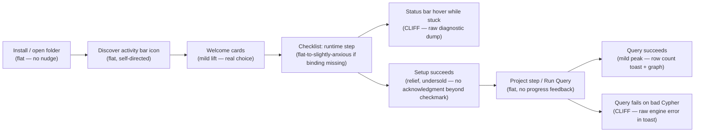

# Emotion audit: GraphForge for VS Code, vs. Kilo Code onboarding patterns

Audited against `origin/main` @ `441f6e7` (worktree, clean checkout — includes PR #25 Welcome mode picker, #21/#23 status-bar recovery, #18 short-label toasts). Comparison source: Kilo Code (`kilo-org/kilocode`) README + user-supplied screenshots of What's New, Migrate Settings, and full settings shell.

## Feeling contract

**Stated (docs/DESIGN.md, docs/PRODUCT.md):** GraphForge in VS Code should feel like a **workbench, not a database admin console**. Supporting tones, stated explicitly:
- **Palette-first** — Cypher and analyst verbs (Rank/Cluster/Paths/Analyze/Similar/Find) are peers, not Cypher-plus-afterthoughts.
- **Epistemic legibility** — belief/ontology status is always named, never flattened to anonymous nodes.
- **Progressive, not shaming** — exploratory ontology (no schema yet) is a valid state, not an error.
- **Fail-closed, never a dead end** — missing runtime/project always names a next action.

**Never-feel (inferred from Voice section + #22):** never a raw stack trace in a panel or toast; never an infrastructure-jargon wall; never "database admin console" procedural coldness.

This is an unusually well-articulated feeling contract for a pre-1.0 extension — most of this audit is checking whether the implementation actually delivers it, not guessing at what it should be.

## Scope & coverage

**Surfaces audited (read source + traced state logic):**
1. Get Started sidebar webview — Welcome mode picker + Runtime/Project/Query checklist (`src/views/getStartedView.ts`)
2. Status bar item — text + tooltip (`src/session/graphForgeSession.ts`, `src/session/runtimeSelection.ts`, `src/session/nativeLoader.ts`)
3. Setup recovery path (`offerSetupRecovery`, `src/commands/shared.ts`)
4. Run Query success/error path, including the result document and info/error toasts (`src/commands/runQuery.ts`)
5. Result Graph webview — legend, styling modes, empty state (`src/webview/resultGraphPanel.ts`)
6. Ontology — tree view (`src/views/ontologyTree.ts`) and viewer webview (`src/webview/ontologyPanel.ts`)
7. Published-facing docs a new user would actually read (`docs/published/install.md`, `overview.md`)
8. Kilo Code comparison points: What's New cards, Migrate Settings checklist w/ progress, post-migration summary, full settings left-nav + welcome cards (screenshots), README/onboarding claims

**Not yet covered (naming the blind spots, per audit method step 8):**
- Knowledge view's full inspect/create/Advanced flows (FR-9–FR-11) — only the tree's empty-state shape was skimmed, not `createAssertion`/`attachEvidence` QuickPick copy.
- The six analyst-verb QuickPick chains (Rank/Cluster/Paths/Analyze/Similar/Find) and their `*Advanced` variants — not walked step-by-step; `docs/experience/agent-interop.md` documents their shape but this audit didn't trace the actual prompt copy.
- Power features (checkpoints, embedding spaces, indexing, composite transactions) — out of scope for this pass; these are more integrator-facing than the moments the ask named.
- Live rendering/visual QA (no VS Code Extension Development Host was launched) — everything below is traced from source (HTML/CSS/message-passing logic), not from a live screenshot of GraphForge itself. Colors, spacing, and real font rendering are inferred, not observed.
- Kilo's actual in-product motion/animation and its CLI/JetBrains surfaces — only the VS Code screenshots and README were available.

## State matrix

| Surface | Empty | Loading | Error | Success | Recovery |
|---|---|---|---|---|---|
| Get Started (Welcome) | present — cards render with no prior state | not modeled (no async before Continue) | missing — no card-selection-required guard, but also no way to fail | present — "Continue" persists mode, always succeeds | n/a (not a failure surface) |
| Get Started (checklist) | present — genuinely first-run state, all 3 steps `pending`/`current` | unexamined — `refresh()` posts state synchronously from cached session data; no spinner if `environmentSnapshot()` is slow (e.g. cold Python interpreter probe) | missing — steps only show `current`/`done`, never a failed-attempt state (e.g. "Setup Native Binding" QuickPick was dismissed) | present — "You're ready to explore" headline + verb-forward subhead | present — same webview, doubles as the recovery target for `offerSetupRecovery` |
| Status bar | present — `$(database) GraphForge`, "No project open" | unexamined — no distinct in-flight text while `environmentSnapshot()` resolves | present but **inconsistent** — text is short (`$(warning) GraphForge: no runtime`), tooltip is a raw diagnostic concatenation (see Valence cliffs) | present — `$(database) GraphForge: {project} ({mode}) · {runtime}` | present — click routes to Get Started or Capabilities |
| Recovery toast (setup) | n/a | n/a | **removed** — `offerSetupRecovery` no longer shows a toast at all (bbd442f); it opens Get Started directly | n/a | present — Get Started panel is the recovery surface |
| Run Query | n/a (query step is `pending` until ready) | missing — no progress indicator between invoking Run Query and the result document appearing; a slow Cypher query has no "running…" feedback | present but **regressed relative to setup recovery** — raw `err.message` + query snippet in a `showErrorMessage` toast, not routed through the `recoveryToastMessage` short-label helper that already exists in the same file (`src/commands/shared.ts:30`) | present — JSON result doc + `"GraphForge: N row(s)"` toast + optional Result Graph panel | n/a — error path returns `{ error, code }` but nothing re-opens Get Started or suggests a next step for a genuinely bad Cypher query (not a setup problem, so arguably correct to omit) |
| Result Graph | present — "Waiting for graph data…" placeholder text, plus a genuinely empty-nodes case (`!nodes.length`) that reuses the same placeholder | unexamined — no distinct loading state; panel opens then waits for a `postMessage` | missing — no path renders an error inside the graph webview itself; a failed query never reaches this panel (correct: it fails before the panel opens) | present — legend, styled nodes/edges, footer summary (node/edge counts + styling mode) | n/a |
| Ontology (tree + viewer) | **present and unusually good** — explicit copy distinguishing "exploratory is fine" from "advisory/strict needs a load" (`ontologyTree.ts:119-133`, `ontologyPanel.ts:160-163`) | unexamined | missing — no distinct "ontology failed to parse" state; a malformed `ontology.json` isn't modeled here | present — entity/relation/property lists with counts | present — "Load Ontology…" is offered from the empty state itself, not a separate recovery path |
| Knowledge tree | present (lightly checked) — group/summary/action node kinds exist for empty ledger | unexamined | unexamined | unexamined (not traced beyond node shape) | unexamined |

## Scorecard

| Dimension | Score | Evidence |
|---|---|---|
| Clarity | 4/5 | Get Started checklist states its badge/status/detail line for every step in one glance; Ontology's exploratory-vs-strict copy is a model of "explain the state, don't just show it empty." Docked one point for the runtime step's dangling "Setup Python" secondary action even when the step is marked `done` (`getStartedView.ts:399-405` — both the `runtimeReady` and `!runtimeReady` branches produce the identical `{ label: "Setup Python", command: "graphforge.setupPythonBinding" }`), which asks "why is there still a setup action on a step with a checkmark?" |
| Trust | 3/5 | The setup-recovery path (Get Started panel, `checkEnvironment`'s 3-line summary) genuinely earned trust by removing raw diagnostics from the human-facing toast/panel path — this is real, verified-on-`main` progress, not aspirational docs. But two live counter-examples pull this down: (1) the status-bar **tooltip** still concatenates `err.message` from failed `require()` calls verbatim, including "Require stack:" (`nativeLoader.ts:41-51` → `runtimeSelection.ts:63-69`) — the exact failure mode the screenshot (`image-b104ad3d`) captured is still reachable today, just one click deeper (hover instead of glance); (2) Run Query's failure toast shows the raw engine `err.message` (`runQuery.ts:147-150`) even though a `recoveryToastMessage` short-label helper already exists in the same module and is used nowhere. |
| Energy | 3/5 | The Welcome mode cards (Guided/Autonomous) are the one moment with real personality — a real choice, worded in the product's own vocabulary, not agent-autonomy jargon. Everything after that is calm-to-flat by design (a workbench should not be exciting), which is correct for this genre, but the "You're ready to explore" success headline is the only peak-end moment in the whole checklist; nothing marks first successful query or first ontology load as a peak. |
| Belonging | 3/5 | Copy is consistently analyst-facing ("Pick a folder with a FORMAT marker," "Run Cypher, analyst verbs, and browse ontology") rather than infra-facing, which matches the target persona. Docked for the published-facing quick start (`docs/published/install.md`) — the doc a new Marketplace user actually reads — never mentioning the Get Started sidebar at all; it tells them to run `Check Environment` from the palette, which is the *old* (pre-#22) recovery path. A new user following the docs literally would miss the panel the product team just built for them. |
| Control | 4/5 | Guided vs. Autonomous is a real, reversible control lever ("Change mode" reopens Welcome anytime); confirmations on destructive Initialize are preserved in Guided and explicitly still fail closed in Autonomous per DESIGN.md. Agent interop doc is a strong control story for a second persona (coding agents) — structured `{ error, code, nextAction }` instead of a blocking dialog is exactly the right shape. Docked one point because activation is `onLanguage:cypher` / `workspaceContains:FORMAT` with no `walkthroughs` contribution — a brand-new user who opens a *blank* folder has no built-in nudge toward the GraphForge activity-bar icon at all; they have to already know to look for it. |

## Valence walk

The intended arc: **uncertain → oriented → capable.** First-run should feel like "someone is walking me through this," setup failure should feel like "the tool knows what's wrong and what to do," and first successful query should feel like a small "it worked" peak. Mapped against the actual states:

### Valence cliffs

1. **Status bar tooltip raw diagnostic dump (still live).** `describeRuntimeUnavailable` interpolates `node.error`/`python.error` directly (`runtimeSelection.ts:63-69`), and `node.error` is built by joining every failed `require()` candidate's raw `.message`, including Node's own "Cannot find module… Require stack:" text (`nativeLoader.ts:41-51`). This is the *exact* string shown in `image-b104ad3d`. The status-bar **text** itself is now short and calm (`$(warning) GraphForge: no runtime`) — that part of #21/#23 genuinely fixed the glanceable surface — but the tooltip one hover away still contradicts DESIGN.md's own rule ("never inline stack traces in the panel or toasts"). A user who hovers to understand *why* lands exactly back in "database admin console" territory the product explicitly says it isn't.
2. **Run Query failure toast, raw error + query echo.** `showErrorMessage(\`GraphForge query failed: ${message} — query: ${querySnippet(cypher)}\`)` (`runQuery.ts:147-150`) surfaces the engine's raw message. This is a smaller cliff than #1 (Cypher errors are more likely to be genuinely informative engine messages, e.g. a syntax error), but it's inconsistent: setup failures get a curated experience, query failures get the old, un-curated one. The `recoveryToastMessage` helper that exists specifically to prevent this (`shared.ts:26-40`) is dead code — grep confirms zero call sites outside its own definition.
3. **Docs/product mismatch for new-user quick start.** `docs/published/install.md`'s "Quick start" (the doc surfaced to a real Marketplace installer) routes through the pre-#22 flow ("Run GraphForge: Check Environment from the Command Palette"), never mentioning Get Started, the Welcome mode picker, or the sidebar at all. A user who trusts the docs over the UI will manually rediscover a worse path than the one the team built.

### Dead flats

1. **No peak at first successful setup.** The runtime step flips from `current` to `done` with a checkmark and 0.72 opacity — appropriate restraint for a "workbench, not admin console," but combined with the dangling secondary action (see Clarity), a completed step doesn't read as *resolved*, just *dimmed*.
2. **No progress feedback during Run Query.** Between clicking Run Query and the result document/graph appearing, there is no loading state at all (no status-bar spin, no webview skeleton). For a query that takes a few seconds against a large graph, this reads as "did anything happen?" rather than "GraphForge is thinking."
3. **First-run discovery is silent.** Nothing in `extension.ts` reveals Get Started on first activation (no `revealGetStarted` call at startup, no `walkthroughs` contribution in `package.json`). This is explicitly named as **not yet done** in the product's own issue tracker: #22's "Future (optional v1)" section lists "Auto-open Get Started on first activation" as deferred. The Welcome cards that exist are good; nothing currently causes a first-time user to see them without already knowing to click the activity bar icon.

## Kilo pattern mapping

| Kilo pattern (screenshot) | Maps to GraphForge? | Notes |
|---|---|---|
| Welcome "Choose how you want to work" cards (`image-79bccf2a`) | **Yes — done well (#25).** | Guided/Autonomous cards use GraphForge's own vocabulary (confirmations, project auto-detect, Result Graph auto-open) instead of borrowed agent-autonomy language ("Review First"/"High Autonomy"). This is the strongest piece of Kilo-inspired work in the product and correctly avoids copying Kilo's brand colors (`docs/DESIGN.md` calls this out explicitly). |
| Migrate Settings checklist w/ per-item progress (`image-5d8dd15f`, `image-85d9b666`) | **Does NOT map — correctly not attempted.** | Kilo's Migrate flow exists because Kilo is itself a *replacement* for a prior extension/config a user is switching from (there's something concrete to migrate: API keys, chat history). GraphForge has no predecessor product and no per-user state to migrate — attempting to force this pattern in would manufacture a checklist with nothing real to check. Correct omission. |
| Post-migration success summary + "Copy Report" (`image-b0df651f`) | **Partial equivalent exists, less rich.** | GraphForge's closest analog is the checklist step flipping to `done` + the "You're ready to explore" headline. Kilo's version has a per-item outcome list and a copyable report; GraphForge's has neither. Given GraphForge's own agent-interop story (`checkEnvironment` already returns copyable JSON), a "Copy Environment Report" affordance next to Check Environment would be a small, on-brand addition — not a full migration-report clone. |
| What's New on version bump (`image-8e1bd6f6`) | **Not applicable yet, will be soon.** | GraphForge is pre-1.0 (`version: 0.1.0`), unpublished (issue #20 open — Marketplace/Open VSX publishing blocked on secrets), and has no `CHANGELOG.md`. There is nothing to announce yet. This is explicitly deferred in #22's "Future (optional v1)" list ("What's New on version bump") — correctly not built prematurely, but worth planning before the first post-publish update ships, or the first real "what changed" moment will be silent. |
| Settings left-nav shell (`image-79bccf2a` right panel) | **Explicitly deferred — tracked as #24.** | `docs/DESIGN.md` names this directly: "out of scope for this phase — tracked as a follow-up issue rather than a stub UI." Issue #24 (open) scopes it as Runtime/Project/Experience/Advanced categories over existing `graphforge.*` settings, explicitly *not* a VS Code Settings UI replacement. This is the one Kilo pattern GraphForge has a live, scoped ticket for — good project hygiene, not a gap this audit needs to invent. |
| Agent Manager / multi-agent worktree switching (`image-8e1bd6f6`) | **Does NOT map — should not be attempted.** | This is Kilo's core "manage parallel coding agents" identity. GraphForge is a single-session analyst workbench over one graph project; there is no multi-agent concept to manage. Correctly absent, and should stay absent — importing this pattern would be a category error (Impeccable would flag this as importing another product's core mechanic without the underlying job to justify it). |
| Kilo's persistent left-rail icon strip always visible regardless of activation | **Structurally close, but see Control finding.** | GraphForge's activity-bar icon is always visible (contributed, not activation-gated) but nothing currently draws a first-time user's eye to it — no badge, no `walkthroughs` entry, no auto-reveal. Kilo's chat panel is the extension's *entire* UI, so a user opening it is guaranteed to land there; GraphForge's Get Started view competes for attention with Explorer/Source Control/etc. in the same activity bar. |

## Accessibility floor

- No motion/animation exists in any of the audited webviews (no transitions, no auto-playing content) — nothing here overrides `prefers-reduced-motion` because nothing needs to.
- All three webviews (Get Started, Ontology, Result Graph) consistently use `var(--vscode-*)` theme tokens for foreground/background/border, which is the correct approach for contrast and theme-parity (light/dark/high-contrast) — this wasn't spot-checked against an actual high-contrast theme render, so treat as "implemented correctly" rather than "visually verified."
- **P0 candidate, unverified:** the Get Started Welcome cards use a custom `.radio` div (a manually drawn circle) as the mode selector, not a native `<input type="radio">` or ARIA `role="radio"`/`aria-checked` pair (`getStartedView.ts:183-187`, `293-300`). Clicking the card div works with a mouse, but there's no visible keyboard-focus style, no `tabindex`, and no ARIA role on the card itself — a keyboard-only or screen-reader user cannot see or announce which mode is selected. This is worth a real accessibility pass before any wider release, not just a feeling nitpick — flagging as P0 per audit method step 7 ("a11y issues are P0"), scoped to *this specific control*, not the whole webview (VS Code webviews inherit host theming/zoom, which covers the broader floor).
- Result Graph's epistemic-status legend uses color as the *only* differentiator for node/edge status (dot color, no icon or pattern redundancy) other than the dashed-vs-solid border toggle between epistemic and class-only modes. For users with color vision deficiency, two adjacent epistemic statuses could be hard to distinguish by color alone — the legend text labels mitigate this somewhat (hovering/reading the legend still tells you the status name), but the graph nodes themselves have no non-color encoding.

## P0 / P1 / P2

**P0 — accessibility/emotion blockers**
- Get Started Welcome mode cards: add keyboard focus/selection (native radio semantics or `role="radio"`/`aria-checked`/`tabindex`) so mode choice is announced and operable without a mouse. *New issue candidate.*

**P1 — trust dilution (contradicts the product's own stated doctrine)**
- Route `getNativeLoadError()`/`describeRuntimeUnavailable()`'s tooltip content through a short, curated summary instead of raw joined `require()` error messages — the status bar text already does this; the tooltip should match. *New issue candidate — reads as a "finish #21/#23" follow-up, not a new feature.*
- Route Run Query's failure toast through the existing (currently unused) `recoveryToastMessage` helper, or an equivalent, instead of raw `err.message` + query echo; keep the full message in the JSON result document for agent/human copy-paste, same pattern already used for setup recovery. *New issue candidate.*
- Fix `docs/published/install.md`'s Quick Start to mention the Get Started sidebar / Welcome mode picker instead of only "run Check Environment from the palette" — the doc a real installer reads should describe the actual best path. *New issue candidate (docs), small.*
- Fix the runtime checklist step's dangling "Setup Python" secondary action appearing even when the step is `done` (`getStartedView.ts:402-405`) — collapse to no secondary action, or change its label/intent when the step is already resolved. *New issue candidate, small.*

**P2 — polish / dead flats**
- Add a lightweight loading indicator between "Run Query" and the result appearing (status-bar spinner or a single "Running…" line), so slow queries don't read as unresponsive.
- Consider auto-revealing Get Started on first activation, or adding a `contributes.walkthroughs` entry — already named as deferred in #22's "Future" list; this audit adds the emotional justification (first-run currently has no nudge at all) but doesn't need a new ticket since #22 already tracks it as a known follow-up.
- Add a small "Copy Environment Report" affordance near Check Environment, echoing (in spirit, not form) Kilo's post-migration "Copy Report" — GraphForge already produces copyable JSON; surfacing a copy action would close the loop without importing Kilo's migration framing.
- Plan a "What's New" surface (checklist-adjacent banner or `viewsWelcome` entry) before the first post-1.0 version bump ships — not urgent pre-publish (already named in #22 as deferred), but worth sequencing so the first real update isn't silent.

---

## Top 5 prioritized recommendations

| # | Recommendation | Priority | Status |
|---|---|---|---|
| 1 | Give the Welcome mode-picker cards real keyboard/ARIA radio semantics (focus outline, `aria-checked`, `tabindex`) | P0 | **New issue candidate** — no existing ticket covers this; #22/#25 shipped the visual cards but not their accessible interaction model. |
| 2 | Make the status-bar **tooltip** as curated as the status-bar **text** — stop interpolating raw `require()`/native-load error strings (`Require stack:` and all) into `describeRuntimeUnavailable` | P1 | **New issue candidate**, but scoped as "finish #21/#23" — those PRs fixed the glanceable text; this closes the one-hover-deeper gap the screenshot (`image-b104ad3d`) still reproduces on `main` today. |
| 3 | Route Run Query's failure toast through a short-label helper (reuse the existing, currently-dead `recoveryToastMessage` in `src/commands/shared.ts`) instead of the raw engine message + query echo | P1 | **New issue candidate** — inconsistent with the setup-recovery path's already-shipped standard; the fix (and the helper) already exist, they're just not wired together. |
| 4 | Fix the dangling "Setup Python" action on an already-`done` runtime checklist step, and fix `docs/published/install.md`'s Quick Start to describe the Get Started sidebar instead of the pre-#22 flow | P1 | **New issue candidates** (two small, related fixes) — both are "the newest UX isn't fully threaded through yet," not design debates. |
| 5 | Sequence a first-activation nudge (auto-reveal Get Started and/or a `walkthroughs` contribution) and a future "What's New" surface before the first post-publish version bump | P2 | **Already tracked** — both are explicitly named in #22's "Future (optional v1)" section; this audit's contribution is the emotional case (first run currently has a silent discovery gap) and the sequencing note (What's New should exist *before* the first update ships, not be retrofitted after users are confused by a silent change). |

### Where GraphForge should *not* copy Kilo

Two Kilo patterns were deliberately not chased, and this audit agrees with both omissions: the **Migrate Settings checklist** (no predecessor product, nothing real to migrate — forcing it in would manufacture busywork) and **Agent Manager / multi-worktree switching** (a single-session analyst workbench has no multi-agent concept to manage; importing this would be a category error against GraphForge's own "workbench, not admin console, and not an agent chat" identity). The team's own `docs/DESIGN.md` already draws this line correctly ("interaction patterns, not brand") — the gaps found here are about *finishing* the patterns GraphForge did choose to adopt, not about adopting more of Kilo.
