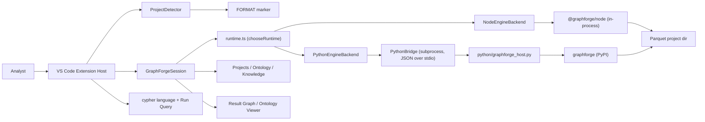

# Architecture

GraphForge for VS Code is a TypeScript extension host that wraps a runtime-agnostic
`EngineBackend` — either `@graphforge/node` (default) or a Python `graphforge` bridge
subprocess (#12) — decodes Arrow IPC results, and presents workbench UI: tree views, Cypher
language support, analyst-verb commands, and webviews for ontology and epistemic-aware graphs.

## Context diagram



## Components

| Component | Responsibility | Depends on |
|---|---|---|
| `extension.ts` | Activation, register commands/views | Session, views, commands |
| `ProjectDetector` | Exact `FORMAT` detection, CURRENT/ontology file reads | Node fs |
| `nativeLoader` | Resolve optional `@graphforge/node` | config / node_modules / sibling repo |
| `pythonLoader` / `pythonProbe` | Detect a Python interpreter and probe `import graphforge` | vscode config/extensions API, `execFile` |
| `nodeEngineBackend` / `pythonBridge` | `EngineBackend` implementations over Node / Python | `types.EngineBackend` |
| `runtime` / `runtimeSelection` | Choose Node vs. Python per `graphforge.runtime`; open the backend | nativeLoader, pythonLoader, both backends |
| `GraphForgeSession` | Open project, execute/verbs, IPC→rows, graph payload | `EngineBackend` + arrow |
| Tree providers | Projects, Ontology, Knowledge sidebars | Session |
| Commands | Run Query, verbs, open panels, load ontology, Setup (Native/Python) | Session, webviews |
| Webviews | Result Graph + Ontology Viewer + Settings + message protocol | Session payloads (Result Graph/Ontology); configuration API + `settingsSchema.ts` (Settings) |
| `webview-ui/` | Vite-built browser bundles for webview panels (currently: Settings) | `src/webview/settingsSchema.ts` |

### Build tooling (Vite, #24)

Vite is the single build tool, per the sequenced decision recorded in issue #24 (Phase 2
complete). Two configs with opposite semantics:

- **Extension host (`vite.config.mts`, repo root):** a Node **library/SSR build** — no dev
  server, no HMR, no app-mode assumptions. `vite build` bundles `src/extension.ts` →
  `dist/extension.js` (single flat CJS file, `vscode` and `@graphforge/node` external,
  `apache-arrow` bundled); `vite build --mode tests` emits per-test-file CJS bundles →
  `dist/test/` and copies `src/test/fixtures/` alongside them.
- **Webview UI (`webview-ui/vite.config.mts`):** browser-side webview apps (config inside this
  package — no monorepo/workspace split). Emits fixed-name bundles to `dist/webview-ui/`
  (e.g. `settings.js` / `settings.css`), which panel hosts load via `webview.asWebviewUri`
  under a nonce-based CSP. The Settings panel is the first Vite-built surface; new webviews
  should start here rather than as inline HTML template strings.
- `npm run compile` runs both (`compile:host` then `compile:webview`); `npm run check`
  type-checks both TS projects (`tsconfig.json` and `webview-ui/tsconfig.json`). The
  `webview-ui` app shares vscode-free modules from `src/` (e.g. `settingsSchema.ts`) by direct
  relative import.

### Runtime abstraction (#12)

`GraphForgeSession` never talks to `@graphforge/node` or Python directly — it only depends on
the `EngineBackend` interface (`src/session/types.ts`), which exposes `execute`, the five
analyst verbs, `labels`/`relationshipTypes`, `ontologyMode`, `loadOntology`, and `dispose`, all
`Promise`-returning so the same session code works whether the backend is synchronous
(Node, wrapped in `NodeEngineBackend`) or a subprocess round-trip (Python, `PythonEngineBackend`).

`runtime.ts` reads `graphforge.runtime` (`auto` | `node` | `python`, default `auto`), checks
Node-binding and Python-interpreter availability, and calls `chooseRuntime` (in the
`vscode`-free `runtimeSelection.ts`, so the selection logic is unit-testable without an
extension host) to decide which backend `openEngineBackend()` constructs. In `auto`, **Node is
the global default**, with one exception: a Python-first workspace (see "Project-kind detection"
below) prefers Python even when Node is available. An explicit `node` or `python` preference
never falls back to the other, and never consults project kind.

### Project-kind detection (auto Python-prefer rule)

`projectKind.ts` (pure, `vscode`-free — same testing convention as `runtimeSelection.ts`)
classifies the workspace as `"python"`, `"node"`, or `"ambiguous"` from static signals gathered
by `projectKindDetector.ts`:

- **Python markers:** `pyproject.toml`, `requirements.txt`, `uv.lock`, `.python-version`,
  `Pipfile`, `environment.yml`/`.yaml`, `setup.py`, a notebook-dominant workspace root
  (`*.ipynb` files at least as common as `.ts`/`.tsx`/`.js`/`.jsx`/`.py` files), or the VS Code
  Python extension reporting an explicitly selected interpreter.
- **Node markers:** a `package.json` at the workspace root.
- **Both present:** Python wins only on a *strong* signal — `pyproject.toml`/`uv.lock` (a real
  uv/Python project manifest, not just a stray `requirements.txt`), or Python `graphforge`
  already being importable in a detected interpreter. Otherwise the workspace is `"ambiguous"`.
- **Neither present:** `"ambiguous"`.

`chooseRuntime(preference, node, python, projectKind)` only consults `projectKind` when
`preference === "auto"`: if `projectKind === "python"` and Python is usable, Python is chosen
even though Node is also available; otherwise the pre-existing Node-first `auto` behavior applies
unchanged. This means `"node"` and `"ambiguous"` project kinds are handled identically — Node
stays the default — matching the product rule "Node remains the global default only when the
repo is Node-ish or ambiguous." `graphforge.runtime` set explicitly to `node` or `python`
overrides this detection entirely.

### Python bridge protocol

`python/graphforge_host.py` ships with the extension (never executed from workspace-local
Python) and is spawned once per open project as a long-lived subprocess — matching the Node
binding's in-process `GraphForge` object lifetime and avoiding a fresh interpreter/import cost
per call. `PythonBridge` (`src/session/pythonBridge.ts`) owns the child process and speaks a
small, versioned, newline-delimited JSON protocol:

```text
→ stdin  (one JSON object per line): {"id": <int>, "op": <str>, ...op-specific fields}
← stdout (one JSON object per line): {"id": <int>, "protocol_version": 1, "ok": true, "result": {...}}
                                   or {"id": <int>, "protocol_version": 1, "ok": false,
                                       "error": <str>, "error_kind": <str>, "code": <str|null>}
```

Ops: `open`, `execute`, `verb` (`{"verb": "rank"|"cluster"|"paths"|"analyze"|"similar"|"find", "args": {...}}`),
`labels`, `relationship_types`, `ontology_mode`, `load_ontology`, `list_assertions`, `close`.
Every table-shaped result is returned as `{"arrow_ipc_base64": <str>}` (an Arrow IPC stream,
base64-encoded) so the extension's existing `apache-arrow` decode path — shared with the Node
binding — consumes it unchanged; non-table results are returned as `{"json": ...}` or bespoke
fields (e.g. `{"labels": [...]}`). Every request is a **thin marshal** straight to a
`graphforge.GraphForge` method call — no Cypher/verb/epistemic semantics are reimplemented in
the host script or the extension (NFR-2). Requests are correlated by `id` so concurrent calls
don't need to be serialized by the extension; a 30s per-request timeout and subprocess
`exit`/`error` handlers reject any pending requests rather than hanging. Diagnostics (tracebacks)
go to stderr only — stdout carries protocol JSON exclusively.

Bump `BRIDGE_PROTOCOL_VERSION` (`pythonBridge.ts`) and the host's `PROTOCOL_VERSION` together for
any breaking wire change, and document it here.

**Known gap:** the underlying `graphforge` Python package does not yet implement `labels()` /
`relationship_types()` (raises `NotImplementedError`, surfaced as `code: "GF_NOT_IMPLEMENTED"`).
`GraphForgeSession.labels()`/`relationshipTypes()` already treat backend failures as non-fatal
(return `[]`), so this degrades gracefully on Python today; it need not block adoption.

## Data model

- **DetectedProject** — root path, CURRENT generation pointer
- **QueryResult** — columns/rows from Arrow tables
- **GraphPayload** — nodes/edges with `epistemicStatus`, `ontologyType`, legend
- **OntologyDoc** — entity_types, relation_types, properties (from workspace participant)

Epistemic statuses: `hypothesis | supported | refuted | disputed | retracted | superseded | statusless`.

## Domain language and boundaries

| Domain concept | Meaning in this project | Boundary / owner |
|---|---|---|
| Project | Directory with exact FORMAT bytes | Detector; engine storage |
| Analyst verb | Non-Cypher algorithm path returning Arrow | Engine; session wraps only |
| Ontology mode | exploratory / advisory / strict | Engine; viewer displays |
| Epistemic status | Belief state on knowledge subjects | Engine ledgers; UI colors extension-owned |
| Result graph | Visualization of query/verb rows | Extension webview |

## Key flows

### Run Cypher

1. User invokes Run Query — command
2. Session ensures project open — GraphForgeSession
3. `forge.execute` → IPC buffer — `@graphforge/node`
4. Decode to rows — apache-arrow
5. Show JSON doc; build GraphPayload; open Result Graph — webview

### Open ontology

1. User opens Ontology view or Show Ontology — command/tree
2. Read `ontologyMode` + workspace `ontology.json` — session/detector
3. Ontology Viewer webview renders mode + types

## Cross-cutting concerns

- **Error handling:** Fail closed on missing binding or invalid FORMAT; `showErrorMessage`. When
  no runtime is usable, the message and recovery actions cover **both** Setup commands (#12).
- **Configuration:** `graphforge.nativeModulePath`, `graphforge.openResultGraphOnQuery`,
  `graphforge.runtime`, `graphforge.pythonInterpreterPath`, `graphforge.experienceMode`
  (`guided` | `autonomous`, default `guided` — set from the Get Started Welcome screen; see
  `docs/DESIGN.md` "Welcome + experience modes").
- **Package manager policy:** Python package installs use **`uv` only, never `pip`** —
  `GraphForge: Setup Python Binding`'s install choice runs `uv add graphforge` in a uv-managed
  project (`pyproject.toml`/`uv.lock` present) or `uv pip install --python <interpreter>
  graphforge` otherwise. If `uv` is not on `PATH`, the command tells the user to install uv first
  and does not fall back to `pip install` (`setupPython.ts`).
- **Security:** Webview CSP restrictive; scripts only for panel UI; no remote project trust
  beyond workspace folders. The Python bridge only ever spawns the extension-bundled
  `graphforge_host.py` (never a workspace-local script) with a user-selected interpreter.
- **Observability:** Status bar shows project name, ontology mode, and active runtime (Node /
  Python), or a "no runtime" warning with both setup paths in the tooltip.
- **Performance:** Python interpreter/`graphforge`-import probes are cached for 15s
  (`pythonLoader.ts`) and invalidated on `graphforge.pythonInterpreterPath`/`graphforge.runtime`
  config changes, workspace folder changes, and (best-effort) Python-extension interpreter
  changes — see `extension.ts`.

## Decisions

- Optional peer on `@graphforge/node` so scaffold installs without a prebuilt napi binary.
- SVG circular layout for Result Graph v0; swap renderer later without changing `protocol.ts`.
- Demo graph when result rows are not graph-shaped, so the epistemic/class legend is reviewable without data.
- Python is reached via a **long-lived subprocess bridge**, not per-call spawns: engine startup
  cost and the project's single-writer lock make a fresh interpreter per request impractical (#12).
- `EngineBackend` is scoped to what `GraphForgeSession` actually calls today, not the full (and
  still-moving) `GraphForgeNative` surface — checkpoints/embeddings/invocation-descriptor APIs
  (#8–#11) are Node-only until those issues define their own cross-runtime contract.
- `auto` prefers Python over an available Node binding in Python-first workspaces (product
  feedback on #12): a fast, in-process Node binding is still the better default absent other
  signals, but a repo that is clearly Python's (has `pyproject.toml`, `uv.lock`, etc. and no
  `package.json`) should not force analysts to also set up a Node binding they don't otherwise
  need. `graphforge.runtime` set explicitly always overrides this.
- Python package installs standardize on `uv` (product feedback on #12): `pip` has no lockfile,
  no project-aware `add`, and mixing it with `uv`-managed environments causes drift; requiring
  `uv` end-to-end (install-uv-first, no fallback) keeps Setup Python Binding's guidance
  unambiguous.

## Risks & trade-offs

- Native addon must match host OS/arch — document local `napi build` / link path.
- Epistemic attachment on UUIDs is stubbed until belief-projection is wired end-to-end.
- Bundling `apache-arrow` increases extension size but simplifies runtime.
- Python bridge adds subprocess lifecycle risk (hangs, unexpected exits) — mitigated by a 30s
  per-request timeout and `exit`/`error` handlers that reject all pending requests.
- The Python `graphforge` package's API can move independently of `@graphforge/node`'s; the host
  script and `EngineBackend` mapping may need updates when it does (defensive coding, not a
  compatibility guarantee).
