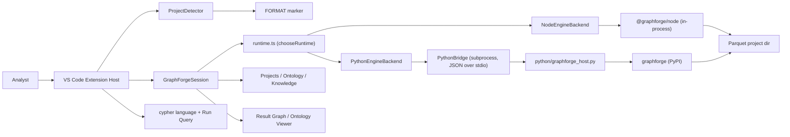

# Architecture

GraphForge for VS Code is a TypeScript extension host that wraps a runtime-agnostic
`EngineBackend` — either `@graphforge/node` (default) or a Python `graphforge` bridge
subprocess (#12) — decodes Arrow IPC results, and presents workbench UI: tree views, Cypher
language support, analyst-verb commands, and webviews for ontology and epistemic-aware graphs.

## Context diagram



## Components

| Component | Responsibility | Depends on |
|---|---|---|
| `extension.ts` | Activation, register commands/views | Session, views, commands |
| `ProjectDetector` | Exact `FORMAT` detection, CURRENT/ontology file reads | Node fs |
| `nativeLoader` | Resolve optional `@graphforge/node` | config / node_modules / sibling repo |
| `pythonLoader` / `pythonProbe` | Detect a Python interpreter and probe `import graphforge` | vscode config/extensions API, `execFile` |
| `nodeEngineBackend` / `pythonBridge` | `EngineBackend` implementations over Node / Python | `types.EngineBackend` |
| `runtime` / `runtimeSelection` | Choose Node vs. Python per `graphforge.runtime`; open the backend | nativeLoader, pythonLoader, both backends |
| `GraphForgeSession` | Open project, execute/verbs, IPC→rows, graph payload | `EngineBackend` + arrow |
| Tree providers | Projects, Ontology, Knowledge sidebars | Session |
| Commands | Run Query, verbs, open panels, load ontology, Setup (Native/Python) | Session, webviews |
| Webviews | Result Graph + Ontology Viewer + message protocol | Session payloads |

### Runtime abstraction (#12)

`GraphForgeSession` never talks to `@graphforge/node` or Python directly — it only depends on
the `EngineBackend` interface (`src/session/types.ts`), which exposes `execute`, the five
analyst verbs, `labels`/`relationshipTypes`, `ontologyMode`, `loadOntology`, and `dispose`, all
`Promise`-returning so the same session code works whether the backend is synchronous
(Node, wrapped in `NodeEngineBackend`) or a subprocess round-trip (Python, `PythonEngineBackend`).

`runtime.ts` reads `graphforge.runtime` (`auto` | `node` | `python`, default `auto`), checks
Node-binding and Python-interpreter availability, and calls `chooseRuntime` (in the
`vscode`-free `runtimeSelection.ts`, so the selection logic is unit-testable without an
extension host) to decide which backend `openEngineBackend()` constructs. `auto` always prefers
Node; Python is only chosen when Node is unavailable and `graphforge` is importable in a
detected interpreter. An explicit `node` or `python` preference never falls back to the other.

### Python bridge protocol

`python/graphforge_host.py` ships with the extension (never executed from workspace-local
Python) and is spawned once per open project as a long-lived subprocess — matching the Node
binding's in-process `GraphForge` object lifetime and avoiding a fresh interpreter/import cost
per call. `PythonBridge` (`src/session/pythonBridge.ts`) owns the child process and speaks a
small, versioned, newline-delimited JSON protocol:

```text
→ stdin  (one JSON object per line): {"id": <int>, "op": <str>, ...op-specific fields}
← stdout (one JSON object per line): {"id": <int>, "protocol_version": 1, "ok": true, "result": {...}}
                                   or {"id": <int>, "protocol_version": 1, "ok": false,
                                       "error": <str>, "error_kind": <str>, "code": <str|null>}
```

Ops: `open`, `execute`, `verb` (`{"verb": "rank"|"cluster"|"paths"|"analyze"|"similar"|"find", "args": {...}}`),
`labels`, `relationship_types`, `ontology_mode`, `load_ontology`, `list_assertions`, `close`.
Every table-shaped result is returned as `{"arrow_ipc_base64": <str>}` (an Arrow IPC stream,
base64-encoded) so the extension's existing `apache-arrow` decode path — shared with the Node
binding — consumes it unchanged; non-table results are returned as `{"json": ...}` or bespoke
fields (e.g. `{"labels": [...]}`). Every request is a **thin marshal** straight to a
`graphforge.GraphForge` method call — no Cypher/verb/epistemic semantics are reimplemented in
the host script or the extension (NFR-2). Requests are correlated by `id` so concurrent calls
don't need to be serialized by the extension; a 30s per-request timeout and subprocess
`exit`/`error` handlers reject any pending requests rather than hanging. Diagnostics (tracebacks)
go to stderr only — stdout carries protocol JSON exclusively.

Bump `BRIDGE_PROTOCOL_VERSION` (`pythonBridge.ts`) and the host's `PROTOCOL_VERSION` together for
any breaking wire change, and document it here.

**Known gap:** the underlying `graphforge` Python package does not yet implement `labels()` /
`relationship_types()` (raises `NotImplementedError`, surfaced as `code: "GF_NOT_IMPLEMENTED"`).
`GraphForgeSession.labels()`/`relationshipTypes()` already treat backend failures as non-fatal
(return `[]`), so this degrades gracefully on Python today; it need not block adoption.

## Data model

- **DetectedProject** — root path, CURRENT generation pointer
- **QueryResult** — columns/rows from Arrow tables
- **GraphPayload** — nodes/edges with `epistemicStatus`, `ontologyType`, legend
- **OntologyDoc** — entity_types, relation_types, properties (from workspace participant)

Epistemic statuses: `hypothesis | supported | refuted | disputed | retracted | superseded | statusless`.

## Domain language and boundaries

| Domain concept | Meaning in this project | Boundary / owner |
|---|---|---|
| Project | Directory with exact FORMAT bytes | Detector; engine storage |
| Analyst verb | Non-Cypher algorithm path returning Arrow | Engine; session wraps only |
| Ontology mode | exploratory / advisory / strict | Engine; viewer displays |
| Epistemic status | Belief state on knowledge subjects | Engine ledgers; UI colors extension-owned |
| Result graph | Visualization of query/verb rows | Extension webview |

## Key flows

### Run Cypher

1. User invokes Run Query — command
2. Session ensures project open — GraphForgeSession
3. `forge.execute` → IPC buffer — `@graphforge/node`
4. Decode to rows — apache-arrow
5. Show JSON doc; build GraphPayload; open Result Graph — webview

### Open ontology

1. User opens Ontology view or Show Ontology — command/tree
2. Read `ontologyMode` + workspace `ontology.json` — session/detector
3. Ontology Viewer webview renders mode + types

## Cross-cutting concerns

- **Error handling:** Fail closed on missing binding or invalid FORMAT; `showErrorMessage`. When
  no runtime is usable, the message and recovery actions cover **both** Setup commands (#12).
- **Configuration:** `graphforge.nativeModulePath`, `graphforge.openResultGraphOnQuery`,
  `graphforge.runtime`, `graphforge.pythonInterpreterPath`.
- **Security:** Webview CSP restrictive; scripts only for panel UI; no remote project trust
  beyond workspace folders. The Python bridge only ever spawns the extension-bundled
  `graphforge_host.py` (never a workspace-local script) with a user-selected interpreter.
- **Observability:** Status bar shows project name, ontology mode, and active runtime (Node /
  Python), or a "no runtime" warning with both setup paths in the tooltip.
- **Performance:** Python interpreter/`graphforge`-import probes are cached for 15s
  (`pythonLoader.ts`) and invalidated on `graphforge.pythonInterpreterPath`/`graphforge.runtime`
  config changes, workspace folder changes, and (best-effort) Python-extension interpreter
  changes — see `extension.ts`.

## Decisions

- Optional peer on `@graphforge/node` so scaffold installs without a prebuilt napi binary.
- SVG circular layout for Result Graph v0; swap renderer later without changing `protocol.ts`.
- Demo graph when result rows are not graph-shaped, so the epistemic/class legend is reviewable without data.
- Python is reached via a **long-lived subprocess bridge**, not per-call spawns: engine startup
  cost and the project's single-writer lock make a fresh interpreter per request impractical (#12).
- `EngineBackend` is scoped to what `GraphForgeSession` actually calls today, not the full (and
  still-moving) `GraphForgeNative` surface — checkpoints/embeddings/invocation-descriptor APIs
  (#8–#11) are Node-only until those issues define their own cross-runtime contract.

## Risks & trade-offs

- Native addon must match host OS/arch — document local `napi build` / link path.
- Epistemic attachment on UUIDs is stubbed until belief-projection is wired end-to-end.
- Bundling `apache-arrow` increases extension size but simplifies runtime.
- Python bridge adds subprocess lifecycle risk (hangs, unexpected exits) — mitigated by a 30s
  per-request timeout and `exit`/`error` handlers that reject all pending requests.
- The Python `graphforge` package's API can move independently of `@graphforge/node`'s; the host
  script and `EngineBackend` mapping may need updates when it does (defensive coding, not a
  compatibility guarantee).
