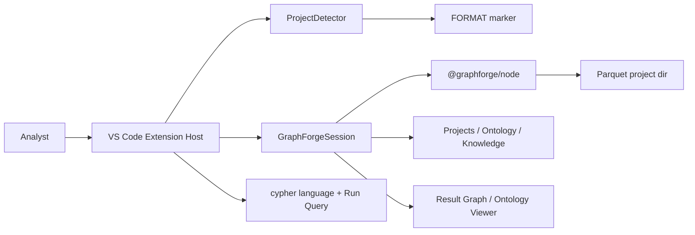

# Architecture

GraphForge for VS Code is a TypeScript extension host that wraps `@graphforge/node`,
decodes Arrow IPC results, and presents workbench UI: tree views, Cypher language
support, analyst-verb commands, and webviews for ontology and epistemic-aware graphs.

## Context diagram

## Components

| Component | Responsibility | Depends on |
|---|---|---|
| `extension.ts` | Activation, register commands/views | Session, views, commands |
| `ProjectDetector` | Exact `FORMAT` detection, CURRENT/ontology file reads | Node fs |
| `nativeLoader` | Resolve optional `@graphforge/node` | config / node_modules / sibling repo |
| `GraphForgeSession` | Open project, execute/verbs, IPC→rows, graph payload | native + arrow |
| Tree providers | Projects, Ontology, Knowledge sidebars | Session |
| Commands | Run Query, verbs, open panels, load ontology | Session, webviews |
| Webviews | Result Graph + Ontology Viewer + message protocol | Session payloads |

## Data model

- **DetectedProject** — root path, CURRENT generation pointer
- **QueryResult** — columns/rows from Arrow tables
- **GraphPayload** — nodes/edges with `epistemicStatus`, `ontologyType`, legend
- **OntologyDoc** — entity_types, relation_types, properties (from workspace participant)

Epistemic statuses: `hypothesis | supported | refuted | disputed | retracted | superseded | statusless`.

## Domain language and boundaries

| Domain concept | Meaning in this project | Boundary / owner |
|---|---|---|
| Project | Directory with exact FORMAT bytes | Detector; engine storage |
| Analyst verb | Non-Cypher algorithm path returning Arrow | Engine; session wraps only |
| Ontology mode | exploratory / advisory / strict | Engine; viewer displays |
| Epistemic status | Belief state on knowledge subjects | Engine ledgers; UI colors extension-owned |
| Result graph | Visualization of query/verb rows | Extension webview |

## Key flows

### Run Cypher

1. User invokes Run Query — command
2. Session ensures project open — GraphForgeSession
3. `forge.execute` → IPC buffer — `@graphforge/node`
4. Decode to rows — apache-arrow
5. Show JSON doc; build GraphPayload; open Result Graph — webview

### Open ontology

1. User opens Ontology view or Show Ontology — command/tree
2. Read `ontologyMode` + workspace `ontology.json` — session/detector
3. Ontology Viewer webview renders mode + types

## Cross-cutting concerns

- **Error handling:** Fail closed on missing binding or invalid FORMAT; `showErrorMessage`.
- **Configuration:** `graphforge.nativeModulePath`, `graphforge.openResultGraphOnQuery`.
- **Security:** Webview CSP restrictive; scripts only for panel UI; no remote project trust beyond workspace folders.
- **Observability:** Status bar shows project name, ontology mode, or binding warning.

## Decisions

- Optional peer on `@graphforge/node` so scaffold installs without a prebuilt napi binary.
- SVG circular layout for Result Graph v0; swap renderer later without changing `protocol.ts`.
- Demo graph when result rows are not graph-shaped, so the epistemic/class legend is reviewable without data.

## Risks & trade-offs

- Native addon must match host OS/arch — document local `napi build` / link path.
- Epistemic attachment on UUIDs is stubbed until belief-projection is wired end-to-end.
- Bundling `apache-arrow` increases extension size but simplifies runtime.
