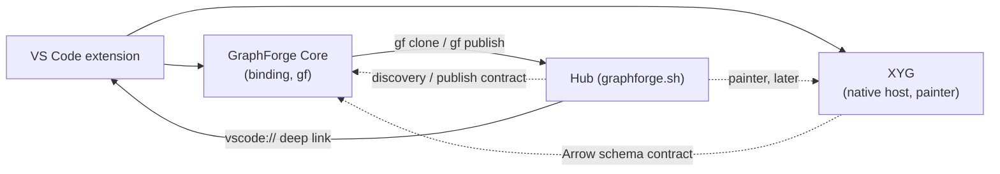

# ADR-0005: Hub, extension, GraphForge Core, and XYG interplay

- Status: Accepted
- Date: 2026-10-03
- Scope: cross-repository (CurateLabs/graphforge, CurateLabs/xyg,
  CurateLabs/graphforge-vscode, CurateLabs/graphforge-nextjs). Recorded here
  because this extension is the only component that touches all three others.

## Context

Four components now make up the GraphForge product. Each grew its own
boundary, but none of them records how the four fit together.

| Component | Today |
|---|---|
| **GraphForge Core** | Native Rust engine with Python and Node bindings and the `gf` CLI. Owns storage, canonical Arrow result schemas, portable-v2 packages, the Hub discovery protocol, `gf clone` and `gf publish`, and the M11 research lifecycle (Project metadata, Sources and Artifacts, Versions, Branches, Forks, Proposals). ADR 0027 keeps execution native; a browser engine was declined (graphforge#495). |
| **XYG** | Rust visualization engine with Python, Node-native, and browser-WASM hosts and a TypeScript WebGL painter. `composeGraphForge` takes raw GraphForge Arrow IPC plus explicit intent. It owns recognition, joins, layout, LOD, Scene, and export. |
| **Extension** | VS Code host. Runs Core through a Node binding or a Python bridge. Writes `queries/`, `results/`, and `visualizations/*.gfviz.json` into the project directory. Is replacing vendor renderers with XYG (#80, #82). |
| **Hub** (graphforge.sh) | Next.js, Cloudflare R2 data plane, Convex control plane. Serves Rust-owned discovery documents and immutable objects. Treats a Project as one opaque portable-v2 package. Renders no graphs, and hosted compute is a non-goal. |

The survey turned up these seams:

1. **Workbench work does not travel.** Queries, saved results, and
   visualizations live only in the project directory. Portable-v2 packages
   carry graph, ontology, settings, and compatibility components. So what
   `gf publish` sends to the Hub, and what `gf clone` returns, loses the
   analyst's actual work.
2. **Visualization specs are owned by the wrong component.** The v2
   `.gfviz.json` contract is extension-owned and records vendor renderer
   fields that #82 deletes. No other host (notebook, Hub) can open it.
3. **A contract flows backwards.** `RESULT_SCHEMAS.md` (result schema to
   visualization disposition) is authored here and vendored into XYG tests,
   but XYG owns recognition and dispositions (the #80 Rust/WASM amendment).
4. **The extension and the Hub have no contract at all.** There is no clone,
   publish, or "open in VS Code". The Hub's planned "Open" tab (Hub #38) has
   nothing to target.
5. **Protocols are duplicated.** The Hub hand-ports the Rust discovery
   validator to TypeScript. The extension must not become a third copy.
6. **The cohort is unpinned.** Core and XYG change in lockstep (exact-match
   ABIs, a ledger pinned to a GraphForge version), yet the extension resolves
   Core as a user-installed optional peer and XYG from vendored tarballs.
7. **"Hub" means two things.** Get Started has a page named Hub, and
   graphforge.sh is the Hub.

## Options considered

1. **Contract star: Core at the centre, thin clients** (chosen). Each
   cross-component contract has one Rust owner and a conformance corpus. The
   extension and the Hub meet only through Core-moved Projects and a deep
   link.
2. **Hub as service backbone.** The Hub hosts compute and rendering (through
   graphforge#215 or #1200), and the extension syncs with a Hub API. This
   gives rich web previews and collaboration. But it contradicts the Hub's
   no-hosted-compute non-goal and Core ADR 0027, and it adds auth, transport,
   and cost before there is evidence of demand. It stays reachable later,
   because graphforge#1200 can add a native authority without changing the
   ownership map below.
3. **Extension as integration centre.** This is the status-quo trajectory.
   The extension owns workbench layout and its own visualization format, and
   ports the Hub protocol to TypeScript. It is fastest in the short term, but
   it creates a third protocol copy, a viz format no other host can read, and
   published Projects with no visible work.

## Decision

### 1. Ownership: one sentence each

- **Core** computes and moves data. It owns graph semantics, result schemas,
  project and package formats, versions and lineage, and the Hub wire
  protocol, including its client (`gf clone`, `gf publish`). It depends on
  nothing else here.
- **XYG** turns typed results plus explicit intent into pictures. It owns the
  composition-intent document, the result-disposition ledger, Scene, paint,
  and export. It depends on Core only as a data contract (Arrow schemas and
  metadata), never as code.
- **Extension** is the editor workbench. It captures analyst and agent intent,
  orchestrates Core and XYG, and owns the VS Code experience, the in-editor
  agent command surface (`graphforge.agent-context/v*`), and the `vscode://`
  deep link. It never re-implements engine, visualization, or Hub-protocol
  semantics. Agents working outside VS Code use Core's `gf` and agent skills,
  not the extension.
- **Hub** gives Projects identity, distribution, and discovery. It serves
  Core-produced bytes and renders pages from Core-produced summaries. It never
  executes GraphForge queries.

### 2. Dependency direction is acyclic

Solid arrows are code dependencies; dotted arrows are contract-only
dependencies. The Hub reaches the extension only through a URI the user
clicks. The extension reaches the Hub only through Core.

### 3. The Project at an immutable Version is the unit of exchange

Everything that crosses a component boundary is a GraphForge Project (or a
result from one), identified by Core's identities: package digest, Version,
and generation. Only Core moves Projects between machines. The extension calls
Core to clone, publish, export, and import (binding API, or `gf` through the
CLI package). It never speaks HTTP to the Hub or parses discovery documents
itself.

### 4. Every contract has exactly one owner and a corpus

| Contract | Owner | Consumers prove conformance by |
|---|---|---|
| Project format, portable-v2, Versions and lineage | Core | Core fixtures and reopen tests |
| Canonical Arrow result schemas and algorithm descriptors | Core | real engine fixtures (`scripts/generate-result-fixtures.cjs`) |
| Hub discovery and publish protocol | Core | the Rust conformance corpus (the Hub's `packages/protocol` parity check) |
| Composition intent, disposition ledger, Scene, paint protocol | XYG | `graphforgeLedger()` at runtime plus XYG fixtures. XYG CI consumes Core's result-schema corpus, so an unmapped schema fails XYG's build |
| Deep link and agent command surface (`graphforge.agent-context/v*`) | Extension | extension integration tests |
| Catalog pages, stars, metering | Hub | Hub tests |

Authority over `RESULT_SCHEMAS.md` moves to XYG. This repository keeps only a
test asserting that XYG's runtime ledger covers every entry in Core's
`algorithmDescriptorContracts()`.

### 5. A visualization is an XYG intent document, not an extension spec

A saved visualization is an XYG-owned, versioned composition-intent document:
intent, layers, and references to source results by digest, bound to the
Project Version and generation they were computed from. It has no renderer,
vendor, or extension fields. Saved results are Arrow IPC snapshots referenced
by digest. The document holds no absolute or machine-local paths, so a future
remote authority (graphforge#1200) could resolve the same references.

An XYG static export (SVG or PNG) may be stored beside the document for viewers
that have no compute. Precomputed Scenes are never persisted. Scene is an
XYG-internal, exact-version format and must not be frozen into immutable
published packages.

Core packages these files as opaque, integrity-checked workbench content, so
they survive portable export, `gf publish`, and `gf clone`. The mechanism is
open question Q1. Core never interprets them; that would put visualization in
Core.

This replaces the extension's `graphforge.visualization/v2` writer as part of
#82's pre-v1 clean break. No reader for the old format is kept.

### 6. Placement of execution

- **Core computation** runs natively and locally: in the extension host, a
  notebook, or `gf`. It never runs on the Hub and never in a browser.
- **XYG composition** for the extension runs on the XYG native host in the
  extension host. The webview is the XYG painter only. The 1,024-element WASM
  cap makes WASM unfit for editor-scale graphs.
- **XYG WASM** is reserved for browser viewers that have only published bytes,
  such as a possible later Hub preview. Composing published Arrow results in
  the visitor's browser needs no GraphForge and no hosted compute.
- **Desktop only, by decision.** Core is native-only, so the extension does
  not support vscode.dev or browser-only Codespaces. It does support local and
  remote extension hosts.

### 7. Distribution: exact pins plus a runtime handshake

Each extension release pins exact Core and XYG versions: no ranges, and no
separate cohort manifest. Per-platform VSIX packages bundle the Core Node
binding and the XYG native core, so the default path needs no binding setup.
The Python bridge stays as an explicit "use my Python environment" runtime.
Before Core v1 there is no project-format migration, so a bundled engine and
the analyst's pip-installed GraphForge can disagree on format. Matching the
notebook's engine is earned complexity until then.

The Python runtime can run a different Core than the one XYG's ledger was
built against. So every session runs a handshake before visualization:

1. The engine reports its version and result-schema versions.
2. XYG checks them against its ledger.
3. On a mismatch, visualization fails with a stable code and a next action.
   It never silently degrades to unrecognized tables.

### 8. Extension and Hub handshake

- **Open from Hub.** The Hub's "Open" tab emits
  `vscode://curatelabsai.graphforge/clone?repository=<owner>/<repo>[&ref=<ref>]`.
  The extension's URI handler confirms with the user, calls Core clone into a
  chosen folder, and opens the Project. The same operation is exposed as an
  agent-callable command that takes the same arguments.
- **Publish.** A later milestone, gated on Hub M3 and Core `gf publish`. The
  extension invokes Core publish. Credentials belong to Core's flow, not to
  extension storage.
- **Publish is opt-in.** Workbench content is never published by default. The
  analyst selects it explicitly, because saved results can contain sensitive
  rows. Until XYG freezes the intent-document format (Q2), only queries and
  static exports can be published. Intent documents and result snapshots
  follow once their formats are stable, so no pre-v1 format is frozen on the
  Hub.
- **No direct calls.** No Hub API is called from the extension, and no
  extension-specific endpoint exists on the Hub.

### 9. Naming

The Get Started "Hub" page becomes "Home", matching its existing title action.
"Hub" then refers only to graphforge.sh.

## Consequences

- Published Projects can carry the analyst's selected queries and
  visualizations. The Hub shows static exports with no compute and no XYG
  dependency. Interactive browser previews through XYG WASM are a later,
  separate decision.
- The extension shrinks to orchestration and experience: no renderer adapters,
  no visualization spec schema, no ledger, no protocol code.
- Each Core or XYG bump is a coordinated extension release. Exact pins make it
  visible and the handshake enforces it at runtime, instead of it surfacing as
  an ABI mismatch or silent misrecognition.
- Removing the vendor renderers (#82) stays gated on XYG base-only
  composition and a published XYG RC. Until then the plain Cypher graph keeps
  its current renderer, so the most common analyst journey never regresses.
- Per-platform VSIX packaging (already required by #82) becomes the default
  install path for the Core binding as well as for XYG.
- Several outcomes depend on other repositories (Q1–Q3). Until they land, the
  extension keeps its current local behavior for the affected step, without
  adding a stop-gap format.
- Hosted compute or collaboration remains possible later through
  graphforge#1200. It would add an authority behind Core's contracts, not a
  new owner.

## Open questions (for research-it or the owning repository)

- **Q1 (Core):** Should workbench content travel in portable-v2 as Core
  Artifacts with lineage (graphforge#1349), or as a new opaque component
  class? How is it selected for publish without leaking private annotations?
- **Q2 (XYG):** Freeze a versioned composition-intent document format that can
  be stored and reopened across hosts. Add base-only composition, so a plain
  Cypher graph needs no result layer (blocks closing #80).
- **Q3 (XYG / Core):** What does the handshake compare? Candidates are Core's
  per-result `algorithm_schema_version` metadata, a Core-reported schema
  inventory, or the GraphForge compatibility declaration xyg#108 already plans.
- **Q4 (Extension):** Should `gf` be invoked through
  `@curatelabs/graphforge-cli`'s `runCli`, or should clone and publish move
  into binding APIs? Prefer whichever Core treats as public and stable.
- **Q5 (Product):** When does the Python bridge retire? Proposed trigger: Core
  v1 project-format stability.
- **Q6 (Core / Hub):** What does a newer Core do with a published package in
  an older pre-v1 format: refuse it, read it only, or have the Hub hide it?
  The answer bounds how early workbench content can be published.
- **Q7 (Extension):** Should the publish login later surface through
  `vscode.authentication` while Core keeps owning the credential?

## Rollout (strangler order)

1. Rename the Get Started "Hub" page to "Home". This preserves behavior.
2. Tracer bullet: a `vscode://…/clone` URI handler plus an agent-callable
   `graphforge.cloneFromHub`. Both call Core clone of the public
   `openalex/openalex` fixture and open the Project. This runs end to end
   through the Hub (link target), Core (clone), and the extension (open), with
   no new formats.
3. Add the runtime handshake (§7) on the existing XYG path from #80.
4. XYG adds base-only composition; then finish #80's routing.
5. Move ledger authority to XYG. This repository keeps only the coverage test.
6. XYG defines the intent-document format (Q2). Then switch saved
   visualizations to it in #82's clean break, and delete the vendor renderers
   once the gates under Consequences pass.
7. Ship per-platform VSIX packages with bundled Core and XYG natives (#82
   release matrix).
8. Core settles workbench packaging (Q1) and Hub M3 ships publish. Then add
   extension publish with explicit selection, and finally the Hub shows static
   exports on Project pages.

## Tracking

| Step / question | Issue |
|---|---|
| 1. Rename Hub page to Home | #87 |
| 2. Clone from Hub (tracer bullet) | #88; Hub "Open" tab CurateLabs/graphforge-nextjs#38 |
| 3. Runtime handshake | #89; CurateLabs/xyg#936 |
| 4. Base-only composition | CurateLabs/xyg#934, then #80 |
| 5. Ledger authority to XYG | #90; CurateLabs/xyg#936 |
| 6. Intent-document format (Q2) and renderer removal | CurateLabs/xyg#935, #82 |
| 7. Per-platform VSIX | #82 |
| 8. Workbench packaging (Q1), publish, Hub exports | CurateLabs/graphforge#1768, #91, CurateLabs/graphforge-nextjs#55 |
| Q3 handshake signal | CurateLabs/xyg#936 |
| Q6 older published packages | CurateLabs/graphforge#1769 |
