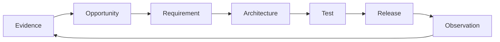

# Experience

This folder connects continuous discovery and experience design to delivery. It captures
what the team has learned from users, the outcomes they need, the opportunities worth
pursuing, and the behavior that would demonstrate improvement.

For a service, library, SDK, CLI, or API, the users may be developers, operators,
integrators, coding agents, or other automated consumers. Keep experience artifacts for
developer experience and agent experience even when product strategy or visual design is
owned elsewhere and omitted from this repo.

## Discovery practice

Maintainer-stated feeling and product intent live in PRODUCT/DESIGN and focused
experience files. External analyst interviews are not yet a routine practice —
treat proto-persona claims as hypotheses until discovery validates them. Durable
decisions stay in this folder or in REQUIREMENTS.

## Experience principles

- **Hunch over admin** — surfaces ask “what can I try next?” not “how do I administer a store?”
- **Concierge without complexity** — guide the path; do not multiply controls or jargon.
- **Fail clear, recover easy** — failures are legible and actionable.
- **Honest waits** — long work announces itself; stuckness is distinguishable from progress.
- **Return is first-class** — resuming is as easy as starting fresh.

See [`discovery-feeling.md`](./discovery-feeling.md) and [`../DESIGN.md`](../DESIGN.md#emotional-north-star).

## Artifact template

```markdown
# Opportunity or experience

## Observed need and evidence
## Desired user and business outcome
## Users and context
## Current journey
## Opportunity and hypothesis
## Intended behavior
## Given / When / Then scenarios
## Constraints and domain language
## Success signals and telemetry
## Open questions
## Related requirements, tests, architecture, and ADRs
```

## Traceability

Discovery artifacts should link forward to requirements they justify. Requirements should
link back here, tests should prove their acceptance behavior, and observability should show
whether the intended outcome happens in production.



## Index

| Document | Kind | Status | What it informs |
|---|---|---|---|
| [discovery-feeling.md](./discovery-feeling.md) | Feeling / journey | Active | Emotional north star (uncovering hunches), need states, moments that matter, trust/anxiety, experience principles |
| [key-journeys.md](./key-journeys.md) | Human journey maps | Active hypothesis | Moving from hunch to inquiry, evidence, collaboration, and continuity; channels are treated as implementation implications |
| [agent-interop.md](./agent-interop.md) | Agent experience / product slice | Active | Stable `graphforge.*` command IDs, structured output shapes, the Check Environment → Setup/Init → Run Query/Rank loop, and remaining argument-bypass gaps |
