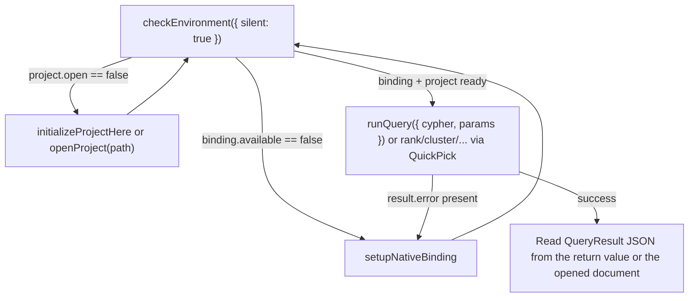

# Agent interop: driving GraphForge from an in-editor coding agent

## Observed need and evidence

Issue [#1](https://github.com/CurateLabs/graphforge-vscode/issues/1) states the UX doctrine explicitly: *"Agent-friendly — stable command IDs, structured result docs, actionable errors with a next step."* Issue [#3](https://github.com/CurateLabs/graphforge-vscode/issues/3) makes this concrete for Cypher: *"results that are skimmable and agent-copyable."* Neither issue had an automated test proving the contract, or a single reference doc a coding agent (or a person driving one) could read to learn the command surface. This document plus `src/test/extension.test.ts` closes that gap: they prove, in CI, that an in-editor coding agent — a Cursor agent, a VS Code Copilot-style agent, or any other extension calling `vscode.commands.executeCommand` — can drive GraphForge end-to-end without clicking through the Command Palette.

## Desired user and business outcome

An analyst pairing with a coding agent (or an agent working unattended) can check the environment, get the project into a runnable state, run Cypher or an analyst verb, and read the result — all through `executeCommand` calls — with no step that silently requires a human to click a UI element the agent cannot see. When something is missing (binding, project), the agent gets a structured reason and a concrete next command to run, not a dead end.

## Users and context

- **Primary user:** an in-editor coding agent (Cursor Agent, GitHub Copilot Agent Mode, or similar) acting inside the same VS Code/Cursor window that has the GraphForge extension activated.
- **Secondary user:** a human developer inspecting the same command IDs and JSON shapes documented here, e.g. from an integration test or a support/debugging session.
- **Context:** the extension may or may not have a working `@graphforge/node` native binding, and may or may not have a `FORMAT`-marked project open — both are common, expected states, not error states.

## Current journey

Before this work: `graphforge.runQuery` only accepted no arguments — it always resolved input from the active editor selection/document or a `showInputBox`, so an agent that already had a Cypher string had no way to skip that prompt. `graphforge.checkEnvironment` returned `undefined` from `executeCommand` (data was only visible in an opened JSON document and a toast), and a missing-project failure inside `runQuery` awaited a button-bearing `showErrorMessage`, which — called programmatically — blocks the calling promise until a human dismisses a dialog they may never see. There was also no test asserting the command surface beyond a 9-command smoke list, and no single doc listing the stable IDs.

## Opportunity and hypothesis

If (a) the highest-value commands accept optional args to skip interactive prompts, (b) every command that already computes a structured result returns it from `executeCommand` instead of `void`, and (c) setup failures resolve immediately with a structured `{ error, code, nextAction }` instead of blocking on a dialog, then a coding agent can complete the Check Environment → Setup/Init → Run Query/Rank loop entirely through `executeCommand`, and that loop is provable in an automated test without a live native binding or project.

## Intended behavior

See [Command ID table](#command-id-table-agent-facing-contract) and [Recommended agent loop](#recommended-agent-loop) below for the full behavioral contract.

## Given / When / Then scenarios

**Scenario: Agent checks environment before doing anything else**
Given the extension is activated
When the agent calls `executeCommand("graphforge.checkEnvironment", { silent: true })`
Then the call resolves (does not throw or hang) with an `EnvironmentReport` object whose `nextAction` field names the next command to run, and no editor tab or toast is opened.

**Scenario: Agent runs a known Cypher query without any UI**
Given a project is open and the binding is available
When the agent calls `executeCommand("graphforge.runQuery", { cypher: "MATCH (n) RETURN n LIMIT 5" })`
Then no QuickPick/InputBox appears, the call resolves with `{ columns, rows, rowCount }`, and (per the existing `graphforge.openResultGraphOnQuery` setting) a results document and/or graph webview may also open for a human pairing with the agent.

**Scenario: Agent hits a missing binding and self-recovers**
Given `@graphforge/node` is not resolvable
When the agent calls `executeCommand("graphforge.runQuery", { cypher: "MATCH (n) RETURN n" })`
Then the call resolves immediately (it does not wait for a human to dismiss the resulting notification) with `{ error, nextAction: 'Run "GraphForge: Setup Native Binding" (graphforge.setupNativeBinding).' }`, so the agent can decide to run that command next or surface the message to the human.

## Constraints and domain language

- **Command ID** — the palette-invocation string (`graphforge.*`), stable across releases; see the table below for the exact set on this branch.
- **Structured output** — a plain JSON-serializable object returned from a command handler (visible to `executeCommand` callers) and/or written into an opened editor document (visible to a human, and copy/paste-able by an agent that can read editor buffers but not command return values, e.g. a chat-only agent without MCP/extension-API access).
- **Fail closed** — a command that cannot do its job (no binding, no project) never silently no-ops or throws an opaque error; it always reports why and what to run next.
- **Node vs Python runtime** — see [Runtime note](#runtime-note-node-vs-python) below.

## Success signals and telemetry

- `src/test/extension.test.ts` passes in CI with no native binding and no project open, proving the "safe" half of the contract (registration + fail-closed behavior) on every PR.
- No regression in the existing human QuickPick-first flows (verified by keeping all existing `showQuickPick`/`showInputBox` call sites unchanged; only args-based bypasses and return values were added).

## Open questions

- Should `rank`/`cluster`/`paths`/`analyze`/`similar`/`find` also accept args (`{ label, by, via, ... }`) to bypass their QuickPick chains? Not implemented here — see [Gaps](#gaps--follow-ups). Tracked informally under [#4](https://github.com/CurateLabs/graphforge-vscode/issues/4).
- Should there be a project-scoped integration test fixture (real `FORMAT` project + a built `@graphforge/node`) so the "needs a live project" half of the contract can also run in CI? Out of scope here.

## Related requirements, tests, architecture, and ADRs

- Requirements: issue [#1](https://github.com/CurateLabs/graphforge-vscode/issues/1) (UX doctrine item 3), issue [#3](https://github.com/CurateLabs/graphforge-vscode/issues/3) (Run Query agent-friendly results).
- Tests: `src/test/extension.test.ts` (`GraphForge agent interop — safe commands` suite).
- Code: `src/commands/runQuery.ts`, `src/commands/setup.ts`, `src/commands/analystVerbs.ts`, `src/commands/shared.ts`.

---

## Command ID table (agent-facing contract)

Source of truth: `package.json#contributes.commands` on `feat/agent-extension-interop` (branched from `feat/integrate-phases-0-4`). All IDs are invoked as `vscode.commands.executeCommand("<id>", ...)`.

| Command ID | Args accepted (optional) | Returns | Interactive prompts if args omitted | Needs live project/binding to do real work |
|---|---|---|---|---|
| `graphforge.checkEnvironment` | `{ silent?: boolean }` | `EnvironmentReport` (`{ binding, project, nextAction, timestamp }`) always | None (info toast + JSON doc unless `silent: true`) | No — this is the command you call *first*, before either exists |
| `graphforge.setupNativeBinding` | none | `void` | 1 QuickPick (link sibling / browse path / npm install) | No (this *sets up* the binding) |
| `graphforge.initializeProjectHere` | none | `void` | 1 QuickPick (workspace folder vs. browse), plus confirmation dialogs for non-empty/missing targets | Needs a binding first (fails closed with a "Setup Native Binding" action button otherwise) |
| `graphforge.openProject` | `pathArg?: string` | `void` | Folder picker only when `pathArg` omitted | Needs the target to already be a valid `FORMAT` project |
| `graphforge.runQuery` | `{ cypher?: string; params?: Record<string, unknown> }` | `QueryResult` (`{ columns, rows, rowCount, algorithm? }`) or `SetupRecovery` (`{ error, code?, nextAction }`) or `{ error }` | Editor selection → whole doc → `showInputBox` only when `args.cypher` omitted/blank | Yes |
| `graphforge.runQueryWithParams` | `{ cypher?: string; params?: Record<string, unknown> }` | Same as `runQuery` | Same cypher resolution as `runQuery`; params `showInputBox` (JSON) only when `args.params` omitted | Yes |
| `graphforge.rank` / `rankAdvanced` | none yet (see [Gaps](#gaps--follow-ups)) | Verb result object (`{ verb, by, label, columns, rows, rowCount, algorithm? }`) or `SetupRecovery` or `{ cancelled: true }` / `{ error }` | Label QuickPick, algorithm QuickPick (+ via/directed/writeProperty prompts if `Advanced`) | Yes |
| `graphforge.cluster` / `clusterAdvanced` | none yet | same shape as `rank` | Label + algorithm QuickPick (+ via/directed/writeProperty/vectorProperty if `Advanced`) | Yes |
| `graphforge.paths` / `pathsAdvanced` | none yet | same shape as `rank` | Algorithm QuickPick + source/target `showInputBox` (+ via/directed if `Advanced`) | Yes |
| `graphforge.analyze` / `analyzeAdvanced` | none yet | same shape as `rank` | Label + algorithm QuickPick (+ via/directed if `Advanced`) | Yes |
| `graphforge.similar` / `similarAdvanced` | none yet | same shape as `rank` | Label + algorithm QuickPick (+ via/vectorProperty if `Advanced`) | Yes |
| `graphforge.find` | none yet | same shape as `rank` (no `by`) | Label QuickPick (optional) + query/limit `showInputBox` | Yes |
| `graphforge.showOntology` | none | `void` (opens/reveals webview) | None | No — shows an empty/best-effort viewer without a project |
| `graphforge.showResultGraph` | none | `void` (opens/reveals webview) | None | No — shows a demo graph when no result exists yet |
| `graphforge.showResultGraphAdvanced` | none | `void` | 1 QuickPick + 1 `showInputBox` (belief-resolution policy) | No |
| `graphforge.showCapabilities` | none | `void` (opens markdown doc) or nothing on failure | None (fire-and-forget error toast if no project) | Yes, to see real data |
| `graphforge.loadOntology` | none | `void` | File picker | Yes |
| `graphforge.refreshExplorer` | none | `void` | None | No |

**Structured output today** comes in two forms, both agent-copyable:

1. **Return value** — everything in the "Returns" column above is returned from `executeCommand`, so any extension/agent with access to the VS Code command API can read it directly without opening any editor.
2. **Editor document** — `runQuery`, `runQueryWithParams`, the verb commands, and `checkEnvironment` (unless `silent: true`) also open a `language: "json"` document with the same shape, for a human (or a chat-only agent that can only read visible buffers, not call `executeCommand`) to read.

## Recommended agent loop

1. **Check Environment** — `executeCommand("graphforge.checkEnvironment", { silent: true })`. Inspect `binding.available` and `project.open`; the `nextAction` string always names the exact next command.
2. **Setup / Init if needed** — if the binding is missing, run `graphforge.setupNativeBinding` (this one QuickPick has no args-based bypass yet; see [Gaps](#gaps--follow-ups)); if the binding is fine but no project is open, run `graphforge.initializeProjectHere` (new project) or `graphforge.openProject(path)` (existing project — `path` is a plain string arg, no picker needed). Re-run step 1 to confirm.
3. **Run Query / Rank** — once both are ready, call `graphforge.runQuery({ cypher, params })` for Cypher, or one of the verb commands for an analyst verb (these still need a QuickPick today).
4. **Read the result** — either the `executeCommand` return value or the opened JSON document, per the table above. On failure, the returned object's `error`/`code`/`nextAction` fields (or the verb result's `{ error }`) tell you exactly what to do next — never a bare exception.

## Runtime note (Node vs. Python)

This branch (`feat/integrate-phases-0-4`, and the `feat/agent-extension-interop` branch created from it) only wires the Node native binding (`@graphforge/node`, resolved by `src/session/nativeLoader.ts`) — **Node is the only and therefore default runtime here**. A separate branch, `feat/12-python-runtime` (tracking issue [#12](https://github.com/CurateLabs/graphforge-vscode/issues/12)), adds a Python runtime as a first-class alternative while keeping Node as the default; it has not been merged into the integration branch as of this writing, so its dual-runtime `graphforge.checkEnvironment` surface (reporting which runtime backs the session) is not part of the command contract documented above. When that branch merges, this doc's `EnvironmentReport` shape should be revisited to confirm whether `binding` gains a `runtime: "node" | "python"` field or equivalent, and this note should be updated accordingly.

## Gaps / follow-ups

- **Verb commands (`rank`, `cluster`, `paths`, `analyze`, `similar`, `find`) do not yet accept args.** They always walk their QuickPick chain (label, then algorithm, then advanced prompts). An agent can still read the eventual result (now returned from `executeCommand` instead of `void`), but cannot skip straight to a known `{ label, by, ... }` combination the way it can with `runQuery`. Adding an optional args object mirroring `session.invokeVerb`'s parameter shape would close this gap; deliberately left out of this change to keep the diff small and because issue [#4](https://github.com/CurateLabs/graphforge-vscode/issues/4) already owns the verb-invocation UX.
- **`setupNativeBinding`, `initializeProjectHere`, `loadOntology`, `showResultGraphAdvanced` are QuickPick/dialog-only.** These are inherently about human choices (which folder, which binding source) and are reasonable to leave interactive; an agent's role here is to detect the need (via Check Environment) and either prompt the human or make the choice on the human's behalf by pre-setting `graphforge.nativeModulePath` via the VS Code configuration API before calling `setupNativeBinding`, or by using `openProject(path)`/args-based commands where they exist instead.
- **No live-project integration test.** This branch's automated test (`src/test/extension.test.ts`) proves the fail-closed, no-binding, no-project path in CI. Proving the success path (`runQuery` actually executing Cypher and returning rows) needs a fixture `FORMAT` project and a built `@graphforge/node`, which is out of scope for this activation-time smoke suite.
