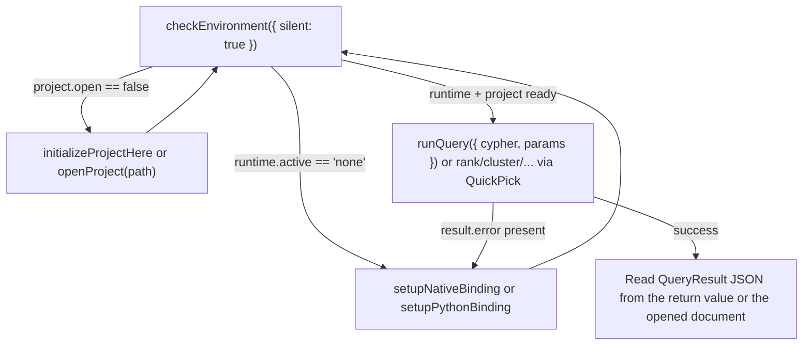

# Agent interop: driving GraphForge from an in-editor coding agent

## Observed need and evidence

Issue [#1](https://github.com/CurateLabs/graphforge-vscode/issues/1) states the UX doctrine explicitly: *"Agent-friendly — stable command IDs, structured result docs, actionable errors with a next step."* Issue [#3](https://github.com/CurateLabs/graphforge-vscode/issues/3) makes this concrete for Cypher: *"results that are skimmable and agent-copyable."* Neither issue had an automated test proving the contract, or a single reference doc a coding agent (or a person driving one) could read to learn the command surface. This document plus `src/test/extension.test.ts` closes that gap: they prove, in CI, that an in-editor coding agent — a Cursor agent, a VS Code Copilot-style agent, or any other extension calling `vscode.commands.executeCommand` — can drive GraphForge end-to-end without clicking through the Command Palette.

## Desired user and business outcome

An analyst pairing with a coding agent (or an agent working unattended) can check the environment, get the project into a runnable state, run Cypher or an analyst verb, and read the result — all through `executeCommand` calls — with no step that silently requires a human to click a UI element the agent cannot see. When something is missing (binding, project), the agent gets a structured reason and a concrete next command to run, not a dead end.

## Users and context

- **Primary user:** an in-editor coding agent (Cursor Agent, GitHub Copilot Agent Mode, or similar) acting inside the same VS Code/Cursor window that has the GraphForge extension activated.
- **Secondary user:** a human developer inspecting the same command IDs and JSON shapes documented here, e.g. from an integration test or a support/debugging session.
- **Context:** the extension may or may not have a working `@curatelabs/graphforge` native binding, and may or may not have a `FORMAT`-marked project open — both are common, expected states, not error states.

## Current journey

Before this work: `graphforge.runQuery` only accepted no arguments — it always resolved input from the active editor selection/document or a `showInputBox`, so an agent that already had a Cypher string had no way to skip that prompt. `graphforge.checkEnvironment` returned `undefined` from `executeCommand` (data was only visible in an opened JSON document and a toast), and a missing-project failure inside `runQuery` awaited a button-bearing `showErrorMessage`, which — called programmatically — blocks the calling promise until a human dismisses a dialog they may never see. There was also no test asserting the command surface beyond a 9-command smoke list, and no single doc listing the stable IDs.

## Opportunity and hypothesis

If (a) the highest-value commands accept optional args to skip interactive prompts, (b) every command that already computes a structured result returns it from `executeCommand` instead of `void`, and (c) setup failures resolve immediately with a structured `{ error, code, nextAction }` instead of blocking on a dialog, then a coding agent can complete the Check Environment → Setup/Init → Run Query/Rank loop entirely through `executeCommand`, and that loop is provable in an automated test without a live native binding or project.

## Intended behavior

See [Command ID table](#command-id-table-agent-facing-contract) and [Recommended agent loop](#recommended-agent-loop) below for the full behavioral contract.

## Given / When / Then scenarios

**Scenario: Agent checks environment before doing anything else**
Given the extension is activated
When the agent calls `executeCommand("graphforge.checkEnvironment", { silent: true })`
Then the call resolves (does not throw or hang) with an `EnvironmentReport` object whose `nextAction` field names the next command to run, and no editor tab or toast is opened.

**Scenario: Agent runs a known Cypher query without any UI**
Given a project is open and the binding is available
When the agent calls `executeCommand("graphforge.runQuery", { cypher: "MATCH (n) RETURN n LIMIT 5" })`
Then no QuickPick/InputBox appears, the call resolves with `{ columns, rows, rowCount }`, and (per the existing `graphforge.openResultGraphOnQuery` setting) a results document and/or graph webview may also open for a human pairing with the agent.

**Scenario: Agent hits a missing binding and self-recovers**
Given `@curatelabs/graphforge` is not resolvable
When the agent calls `executeCommand("graphforge.runQuery", { cypher: "MATCH (n) RETURN n" })`
Then the call resolves immediately (it does not wait for a human to dismiss the resulting notification) with `{ error, nextAction: 'Run "GraphForge: Setup Native Binding" (graphforge.setupNativeBinding).' }`, so the agent can decide to run that command next or surface the message to the human.

## Constraints and domain language

- **Command ID** — the palette-invocation string (`graphforge.*`), stable across releases; see the table below for the exact set on this branch.
- **Structured output** — a plain JSON-serializable object returned from a command handler (visible to `executeCommand` callers) and/or written into an opened editor document (visible to a human, and copy/paste-able by an agent that can read editor buffers but not command return values, e.g. a chat-only agent without MCP/extension-API access).
- **Fail closed** — a command that cannot do its job (no binding, no project) never silently no-ops or throws an opaque error; it always reports why and what to run next.
- **Node vs Python runtime** — see [Runtime note](#runtime-note-node-vs-python) below.

## Success signals and telemetry

- `src/test/extension.test.ts` passes in CI with no native binding and no project open, proving the "safe" half of the contract (registration + fail-closed behavior) on every PR.
- No regression in the existing human QuickPick-first flows (verified by keeping all existing `showQuickPick`/`showInputBox` call sites unchanged; only args-based bypasses and return values were added).

## Open questions

- Should `rank`/`cluster`/`paths`/`analyze`/`similar`/`find` also accept args (`{ label, by, via, ... }`) to bypass their QuickPick chains? Not implemented here — see [Gaps](#gaps--follow-ups). Tracked informally under [#4](https://github.com/CurateLabs/graphforge-vscode/issues/4).
- Should there be a project-scoped integration test fixture (real `FORMAT` project + a built `@curatelabs/graphforge`) so the "needs a live project" half of the contract can also run in CI? Out of scope here.

## Related requirements, tests, architecture, and ADRs

- Requirements: issue [#1](https://github.com/CurateLabs/graphforge-vscode/issues/1) (UX doctrine item 3), issue [#3](https://github.com/CurateLabs/graphforge-vscode/issues/3) (Run Query agent-friendly results).
- Tests: `src/test/extension.test.ts` (`GraphForge agent interop — safe commands` suite).
- Code: `src/commands/runQuery.ts`, `src/commands/setup.ts`, `src/commands/analystVerbs.ts`, `src/commands/shared.ts`.

---

## Command ID table (agent-facing contract)

Source of truth: `package.json#contributes.commands`. All IDs are invoked as `vscode.commands.executeCommand("<id>", ...)`. The table covers every contributed command (#36) — nothing is silently outside the contract.

**Shared outcome union.** Every command that does engine work returns `CommandOutcome<T>` (`src/commands/shared.ts`): the success payload `T` listed below, or `SetupRecovery` (`{ error, code?, nextAction }`) when no runtime/project is usable, or `{ cancelled: true }` when a human dismisses an interactive prompt, or `{ error, code? }` when the engine call fails. No handler resolves `undefined` on those paths.

**Destructive commands** (`deleteCheckpoint`, `revertToCheckpoint`, `deleteEmbeddingSpace`, `enableCapability`, `openWithWriteMode`, `publishCompositeTransaction`) keep their human confirmation step unless args include `confirm: true` — an agent must opt in explicitly to skip the modal.

| Command ID | Args accepted (optional) | Returns (success payload) | Interactive prompts if args omitted | Needs live project/binding to do real work |
|---|---|---|---|---|
| `graphforge.checkEnvironment` | `{ silent?: boolean }` | `EnvironmentReport` (`{ runtime: { preference, active }, nodeBinding, python, project, nextAction, timestamp }`) always | None (info toast + JSON doc unless `silent: true`) | No — this is the command you call *first*, before either runtime or project exists |
| `graphforge.copyEnvironmentReport` | none | `EnvironmentReport` (also copies the same JSON to the clipboard, #32) | None | No |
| `graphforge.setupNativeBinding` | none | `void` | 1 QuickPick (link sibling / browse path / npm install) | No (this *sets up* the Node binding) |
| `graphforge.setupPythonBinding` | none | `void` | 1 QuickPick (use detected interpreter / browse / install via `uv`) | No (this *sets up* the Python runtime, #12) |
| `graphforge.initializeProjectHere` | none | `void` | 1 QuickPick (workspace folder vs. browse), plus confirmation dialogs for non-empty/missing targets | Needs a usable runtime first (fails closed with "Setup Native Binding" / "Setup Python Binding" action buttons otherwise) |
| `graphforge.openProject` | `pathArg?: string` | `void` | Folder picker only when `pathArg` omitted | Needs the target to already be a valid `FORMAT` project |
| `graphforge.runQuery` | `{ cypher?: string; params?: Record<string, unknown> }` | `QueryResult` (`{ columns, rows, rowCount, algorithm? }`) | Editor selection → whole doc → `showInputBox` only when `args.cypher` omitted/blank | Yes |
| `graphforge.runQueryWithParams` | `{ cypher?: string; params?: Record<string, unknown> }` | Same as `runQuery` | Same cypher resolution as `runQuery`; params `showInputBox` (JSON) only when `args.params` omitted | Yes |
| `graphforge.rank` / `rankAdvanced` | none yet (see [Gaps](#gaps--follow-ups)) | Verb result object (`{ verb, by, label, columns, rows, rowCount, algorithm? }`) | Label QuickPick, algorithm QuickPick (+ via/directed/writeProperty prompts if `Advanced`) | Yes |
| `graphforge.cluster` / `clusterAdvanced` | none yet | same shape as `rank` | Label + algorithm QuickPick (+ via/directed/writeProperty/vectorProperty if `Advanced`) | Yes |
| `graphforge.paths` / `pathsAdvanced` | none yet | same shape as `rank` | Algorithm QuickPick + source/target `showInputBox` (+ via/directed if `Advanced`) | Yes |
| `graphforge.analyze` / `analyzeAdvanced` | none yet | same shape as `rank` | Label + algorithm QuickPick (+ via/directed if `Advanced`) | Yes |
| `graphforge.similar` / `similarAdvanced` | none yet | same shape as `rank` | Label + algorithm QuickPick (+ via/vectorProperty if `Advanced`) | Yes |
| `graphforge.find` | none yet | `QueryResult & { verb: "find", query, label? }`; a missing-index failure returns `{ error, code?, nextAction }` naming `graphforge.indexText` | Query `showInputBox` + label QuickPick | Yes |
| `graphforge.createCheckpoint` | `{ name?, description? }` | `QueryResult` | Name + description InputBoxes | Yes (Node binding) |
| `graphforge.listCheckpoints` | `{ limit? }` | `QueryResult` | None | Yes (Node binding) |
| `graphforge.openCheckpoint` | `{ name?, cypher? }` (include `cypher` — even `undefined` — to skip the query prompt) | `{ checkpointUuid, generationUuid, query? }` | Checkpoint QuickPick + read-only Cypher InputBox | Yes (Node binding) |
| `graphforge.diffCheckpoints` | `{ from?, to?, scope?, detail? }` | `QueryResult` | From/To InputBox+QuickPick, scope + detail QuickPicks | Yes (Node binding) |
| `graphforge.deleteCheckpoint` | `{ name?, confirm? }` | `QueryResult` | Checkpoint QuickPick + destructive confirm modal (skipped only by `confirm: true`) | Yes (Node binding) |
| `graphforge.revertToCheckpoint` | `{ name?, reason?, confirm? }` | `QueryResult` | Checkpoint QuickPick, reason InputBox, retype-the-name hard confirm (skipped only by `confirm: true`) | Yes (Node binding) |
| `graphforge.embeddingSpaces` | none | `{ embeddingSpaces: [{ space, freshness? }], note? }` (empty list is a valid state, not an error) | None | Yes (Node binding) |
| `graphforge.publishCallerEmbeddings` | `{ name?, input?: { rows, dimensions, sourceProjection, replace? } }` | `{ name, compatibilityId }` | Name InputBox + edit-JSON-in-editor flow + Publish toast | Yes (Node binding) |
| `graphforge.bindEmbeddingSpaceAlias` | `{ alias?, compatibilityId?, replace? }` | `{ alias, compatibilityId, result }` | Alias + compatibility-ID InputBoxes + replace QuickPick | Yes (Node binding) |
| `graphforge.setDefaultEmbeddingSpace` | `{ name? }` or `{ clear: true }` | `{ name?, result }` | Space QuickPick | Yes (Node binding) |
| `graphforge.deleteEmbeddingSpace` | `{ name?, confirm? }` | `{ name, removed }` | Space QuickPick + destructive confirm modal (skipped only by `confirm: true`) | Yes (Node binding) |
| `graphforge.inspectEmbeddingSpaceFreshness` | `{ name? }` (`{}` inspects the default space, no picker) | `{ name?, freshness }` | Space QuickPick | Yes (Node binding) |
| `graphforge.indexText` | `{ label?, properties?, rebuild? }` (or a plain label string, as the Find remediation passes) | `{ command, result }` | Label QuickPick, properties InputBox, rebuild QuickPick | Yes (Node binding) |
| `graphforge.indexVector` | `{ label?, node?, vector?, space? }` (include `space` — even `undefined` — to skip the space prompt) | `{ command, result }` | Label QuickPick, node/vector/space InputBoxes | Yes (Node binding) |
| `graphforge.inspectTextIndex` | `{ label? }` | `{ command, result }` | Label QuickPick | Yes (Node binding) |
| `graphforge.indexAdjacency` | none | `{ command, result }` | None | Yes (Node binding) |
| `graphforge.inspectAdjacency` | none | `{ command, result }` | None | Yes (Node binding) |
| `graphforge.rebuildAdjacency` | none | `{ command, result }` | None | Yes (Node binding) |
| `graphforge.enableCapability` | `{ capabilityId?, version?, confirm? }` | `QueryResult` | ID + version InputBoxes + manifest-mutation confirm modal (skipped only by `confirm: true`) | Yes (Node binding) |
| `graphforge.openWithWriteMode` | `{ mode?, confirm? }` (`mode`: `single_writer` \| `queued_writer` \| `optimistic_multi_writer`) | `{ ok: true, writeMode }` | Mode QuickPick + reopen confirm modal (skipped only by `confirm: true`) | Yes (Node binding) |
| `graphforge.exportInvocationDescriptor` | `{ verb?, label?, by?, invoke? }` | `{ verb, algorithm, fingerprint, projectionFingerprint, canonicalBytesBase64, invocation? }` | Verb/label/algorithm QuickPicks + invoke-now toast | Yes (Node binding) |
| `graphforge.listAlgorithmRuns` | `{ algorithm?, limit? }` | `QueryResult` | None | Yes (Node binding) |
| `graphforge.publishCompositeTransaction` | `{ request?, confirm? }` (both required together for the programmatic path) | `QueryResult` | Expert warning, edit-JSON-in-editor flow, publish confirm modal | Yes (Node binding) |
| `graphforge.runCli` | `{ args?: string[] }` (full CLI argv, e.g. `["status"]`, `["checkpoint","list"]`) | `{ args, exitCode, stdout, stderr }`; no binding ⇒ `{ error, code: "CLI_UNAVAILABLE", nextAction }` | Command QuickPick + custom-args InputBox when `args` omitted | Yes (Node binding — runs the engine CLI in-process via `runCli`) |
| `graphforge.listAssertions` | `{ graphUuid?, limit? }` | `QueryResult` | None | Yes |
| `graphforge.createAssertion` | `{ claim?, subjectUuid?, subjectKind? }` (`subjectKind`: `node` \| `edge`) | `{ assertionUuid }` | Claim/subject-UUID InputBoxes + kind QuickPick | Yes |
| `graphforge.showAssertion` | `{ assertionUuid? }` or a plain UUID string (tree clicks pass one) | Assertion record + `nextActions` array | Assertion QuickPick/InputBox | Yes |
| `graphforge.showAssertionOnGraph` | `{ assertionUuid? }` or a plain UUID string | `{ assertionUuid, graph }` (also opens the Result Graph webview) | Assertion QuickPick/InputBox | Yes |
| `graphforge.attachEvidence` | `{ assertionUuid?, sourceUuid?, sourceKind?, role? }` | `QueryResult` | Assertion + source-UUID prompts, kind + role QuickPicks | Yes |
| `graphforge.assessConfidence` | `{ assertionUuid?, policy?, value? }` | `QueryResult` | Assertion prompt, policy QuickPick, value InputBox | Yes |
| `graphforge.recordAssertionStatus` | `{ assertionUuid?, status?, provenanceUuid? }` | `QueryResult` | Assertion prompt, status QuickPick, provenance InputBox | Yes |
| `graphforge.showOntology` | none | `void` (opens/reveals webview) | None | No — shows an empty/best-effort viewer without a project |
| `graphforge.showResultGraph` | none | `void` (opens/reveals webview) | None | No — shows a demo graph when no result exists yet |
| `graphforge.showResultGraphAdvanced` | none | `void` | 1 QuickPick + 1 `showInputBox` (belief-resolution policy) | No |
| `graphforge.showCapabilities` | none | `void` (opens markdown doc) or nothing on failure | None (fire-and-forget error toast if no project) | Yes, to see real data |
| `graphforge.loadOntology` | none | `void` | File picker | Yes |
| `graphforge.openOntologyFile` | none | `void` (opens the committed ontology.json, or offers Load Ontology) | Button-bearing toast when no committed ontology exists | Yes, to open a real file |
| `graphforge.explainOntologyMode` | none | `void` (opens a markdown explainer) | None | No |
| `graphforge.refreshExplorer` | none | `void` | None | No |
| `graphforge.getStarted` | none | `void` (reveals the Get Started sidebar) | None | No |
| `graphforge.chooseExperienceMode` | none | `void` (reveals the Welcome mode picker) | None | No |
| `graphforge.openSettings` | none | `void` (opens the Settings webview) | None | No |
| `graphforge.statusBarClick` | none | `void` (routes to Show Capabilities or Get Started) | None | No |

**Structured output today** comes in two forms, both agent-copyable:

1. **Return value** — everything in the "Returns" column above is returned from `executeCommand`, so any extension/agent with access to the VS Code command API can read it directly without opening any editor. Commands whose "Returns" column says `void` are view-openers/setup flows whose effect *is* the UI; everything that computes a JSON payload returns it.
2. **Editor document** — `runQuery`, `runQueryWithParams`, the verb commands, `checkEnvironment` (unless `silent: true`), and the checkpoint / embedding-space / index / power / knowledge commands also open a `language: "json"` document with the same shape, for a human (or a chat-only agent that can only read visible buffers, not call `executeCommand`) to read.

## Recommended agent loop

1. **Check Environment** — `executeCommand("graphforge.checkEnvironment", { silent: true })`. Inspect `runtime.active` (`"node" | "python" | "none"`), `nodeBinding.available`, `python.available`, and `project.open`; the `nextAction` string always names the exact next command.
2. **Setup / Init if needed** — if no runtime is usable, run `graphforge.setupNativeBinding` and/or `graphforge.setupPythonBinding` (each is one QuickPick with no args-based bypass yet; see [Gaps](#gaps--follow-ups)); if a runtime is ready but no project is open, run `graphforge.initializeProjectHere` (new project) or `graphforge.openProject(path)` (existing project — `path` is a plain string arg, no picker needed). Re-run step 1 to confirm.
3. **Run Query / Rank** — once both are ready, call `graphforge.runQuery({ cypher, params })` for Cypher, or one of the verb commands for an analyst verb (these still need a QuickPick today).
4. **Read the result** — either the `executeCommand` return value or the opened JSON document, per the table above. On failure, the returned object's `error`/`code`/`nextAction` fields (or the verb result's `{ error }`) tell you exactly what to do next — never a bare exception.

## Runtime note (Node vs. Python)

`graphforge.runtime` (default `auto`) selects which engine backs Cypher/verb calls — see issue [#12](https://github.com/CurateLabs/graphforge-vscode/issues/12) and the root `README.md`'s "Runtimes: Node vs Python" section for the full policy. **Node remains the default for Node-ish and ambiguous workspaces and only backs the advanced Phase 0–4 surfaces** (checkpoints, embedding spaces, indexing, invocation descriptors, composite transactions, and knowledge-ledger writes); the Python bridge is a first-class alternative for `execute` and the analyst verbs, and `auto` prefers it over an available Node binding in Python-first workspaces (`pyproject.toml`, `uv.lock`, `requirements.txt`, etc. — see `src/session/projectKind.ts`). `graphforge.checkEnvironment`'s `EnvironmentReport` reflects both runtimes independently (`nodeBinding`, `python`) plus which one is actually backing the open session (`runtime.active`), so an agent can tell "Node is default but Python is what's active" apart from "neither is usable." Python package installs always go through `uv` (`uv add` / `uv pip install`), never `pip` — see FR-16/FR-18 in `docs/REQUIREMENTS.md`.

## Gaps / follow-ups

- **Verb commands (`rank`, `cluster`, `paths`, `analyze`, `similar`, `find`) do not yet accept args.** They always walk their QuickPick chain (label, then algorithm, then advanced prompts). An agent can still read the eventual result (now returned from `executeCommand` instead of `void`), but cannot skip straight to a known `{ label, by, ... }` combination the way it can with `runQuery` — or with the checkpoint / embedding-space / index / power / knowledge commands, which all accept args since [#36](https://github.com/CurateLabs/graphforge-vscode/issues/36). Adding an optional args object mirroring `session.invokeVerb`'s parameter shape would close this gap; deliberately left out because issue [#4](https://github.com/CurateLabs/graphforge-vscode/issues/4) already owns the verb-invocation UX.
- **`setupNativeBinding`, `initializeProjectHere`, `loadOntology`, `showResultGraphAdvanced` are QuickPick/dialog-only.** These are inherently about human choices (which folder, which binding source) and are reasonable to leave interactive; an agent's role here is to detect the need (via Check Environment) and either prompt the human or make the choice on the human's behalf by pre-setting `graphforge.nativeModulePath` via the VS Code configuration API before calling `setupNativeBinding`, or by using `openProject(path)`/args-based commands where they exist instead.
- **No live-project integration test.** This branch's automated test (`src/test/extension.test.ts`) proves the fail-closed, no-binding, no-project path in CI. Proving the success path (`runQuery` actually executing Cypher and returning rows) needs a fixture `FORMAT` project and a built `@curatelabs/graphforge`, which is out of scope for this activation-time smoke suite.
