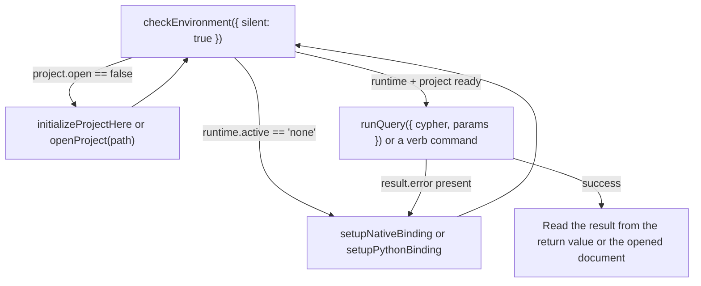

# Agent interop

Every command in [`commands.md`](commands.md) is a stable ID callable via
`vscode.commands.executeCommand("graphforge.<id>", ...)` — no Command Palette click required.
This makes GraphForge drivable end-to-end by an in-editor coding agent (a Cursor agent, GitHub
Copilot Agent Mode, or any other extension calling the VS Code command API), not just by a
human clicking through menus.

## The core loop

1. **Check Environment** — `executeCommand("graphforge.checkEnvironment", { silent: true })`.
   Inspect `runtime.active` (`"node" | "python" | "none"`), `nodeBinding.available`,
   `python.available`, and `project.open`; the returned `nextAction` string always names the
   exact next command to run.
2. **Setup / Init if needed** — if no runtime is usable, run `graphforge.setupNativeBinding`
   and/or `graphforge.setupPythonBinding`. If a runtime is ready but no project is open, run
   `graphforge.initializeProjectHere` (new project) or `graphforge.openProject(path)` (existing
   project — `path` is a plain string arg, no picker needed). Re-run step 1 to confirm.
3. **Run Query / Rank** — call `graphforge.runQuery({ cypher, params })` for Cypher, or one of
   the analyst verb commands (these still walk a QuickPick today).
4. **Read the result** — either the `executeCommand` return value, or the opened JSON document
   the command also writes for a human pairing with the agent. On failure, the returned
   object's `error` / `code` / `nextAction` fields tell you exactly what to do next — never a
   bare exception or a silent no-op.

## What's structured vs. interactive

Every command that does engine work resolves with one of four shapes — never `undefined`:
its success payload (listed below), `{ error, code?, nextAction }` when no runtime/project is
usable, `{ cancelled: true }` when a human dismisses a prompt, or `{ error, code? }` when the
engine call fails. Destructive commands (`deleteCheckpoint`, `revertToCheckpoint`,
`deleteEmbeddingSpace`, `enableCapability`, `openWithWriteMode`,
`publishCompositeTransaction`) keep their confirmation modal unless args include
`confirm: true` — agents must opt in explicitly.

| Command | Accepts args to skip prompts | Returns (success payload) |
|---|---|---|
| `graphforge.checkEnvironment` | `{ silent?: boolean }` | `EnvironmentReport` always |
| `graphforge.copyEnvironmentReport` | none needed | `EnvironmentReport` (also copied to the clipboard) |
| `graphforge.openProject` | `pathArg?: string` | — |
| `graphforge.runQuery` / `runQueryWithParams` | `{ cypher?: string; params?: Record<string, unknown> }` | `QueryResult` (`{ columns, rows, rowCount, algorithm? }`) |
| `graphforge.rank` / `cluster` / `paths` / `analyze` / `similar` (and `…Advanced…`) | Not yet — still QuickPick-driven | Verb result object (`{ verb, by, label, columns, rows, rowCount, algorithm? }`) |
| `graphforge.find` | Not yet — still prompt-driven | `QueryResult & { verb: "find", query, label? }`; a missing-index failure returns `{ error, code?, nextAction }` naming `graphforge.indexText` |
| `graphforge.createCheckpoint` / `listCheckpoints` / `diffCheckpoints` | `{ name?, description? }` / `{ limit? }` / `{ from?, to?, scope?, detail? }` | `QueryResult` |
| `graphforge.openCheckpoint` | `{ name?, cypher? }` | `{ checkpointUuid, generationUuid, query? }` |
| `graphforge.deleteCheckpoint` / `revertToCheckpoint` | `{ name?, confirm? }` / `{ name?, reason?, confirm? }` | `QueryResult` |
| `graphforge.embeddingSpaces` | none needed | `{ embeddingSpaces: [...], note? }` (empty list is a valid state) |
| `graphforge.publishCallerEmbeddings` | `{ name?, input? }` | `{ name, compatibilityId }` |
| `graphforge.bindEmbeddingSpaceAlias` | `{ alias?, compatibilityId?, replace? }` | `{ alias, compatibilityId, result }` |
| `graphforge.setDefaultEmbeddingSpace` | `{ name? }` or `{ clear: true }` | `{ name?, result }` |
| `graphforge.deleteEmbeddingSpace` | `{ name?, confirm? }` | `{ name, removed }` |
| `graphforge.inspectEmbeddingSpaceFreshness` | `{ name? }` (`{}` = default space) | `{ name?, freshness }` |
| `graphforge.indexText` | `{ label?, properties?, rebuild? }` | `{ command, result }` |
| `graphforge.indexVector` | `{ label?, node?, vector?, space? }` | `{ command, result }` |
| `graphforge.inspectTextIndex` | `{ label? }` | `{ command, result }` |
| `graphforge.indexAdjacency` / `inspectAdjacency` / `rebuildAdjacency` | none needed | `{ command, result }` |
| `graphforge.enableCapability` | `{ capabilityId?, version?, confirm? }` | `QueryResult` |
| `graphforge.openWithWriteMode` | `{ mode?, confirm? }` | `{ ok: true, writeMode }` |
| `graphforge.exportInvocationDescriptor` | `{ verb?, label?, by?, invoke? }` | `{ verb, algorithm, fingerprint, projectionFingerprint, canonicalBytesBase64, invocation? }` |
| `graphforge.listAlgorithmRuns` | `{ algorithm?, limit? }` | `QueryResult` |
| `graphforge.publishCompositeTransaction` | `{ request?, confirm? }` (both together) | `QueryResult` |
| `graphforge.listAssertions` | `{ graphUuid?, limit? }` | `QueryResult` |
| `graphforge.createAssertion` | `{ claim?, subjectUuid?, subjectKind? }` | `{ assertionUuid }` |
| `graphforge.showAssertion` / `showAssertionOnGraph` | `{ assertionUuid? }` or a plain UUID string | Assertion record + `nextActions` / `{ assertionUuid, graph }` |
| `graphforge.attachEvidence` | `{ assertionUuid?, sourceUuid?, sourceKind?, role? }` | `QueryResult` |
| `graphforge.assessConfidence` | `{ assertionUuid?, policy?, value? }` | `QueryResult` |
| `graphforge.recordAssertionStatus` | `{ assertionUuid?, status?, provenanceUuid? }` | `QueryResult` |
| `graphforge.setupNativeBinding` / `setupPythonBinding` / `initializeProjectHere` / `loadOntology` / `showResultGraphAdvanced` | No — these are inherently human choices (which folder, which binding source) | — |
| `graphforge.showOntology` / `showResultGraph` / `showCapabilities` / `openOntologyFile` / `explainOntologyMode` / `refreshExplorer` / `getStarted` / `chooseExperienceMode` / `openSettings` / `statusBarClick` | No prompts to skip | — (view-openers; their effect is the UI they open) |

The full per-command contract (prompt-by-prompt) lives in
`docs/experience/agent-interop.md` in the repository, proven by the
`src/test/extension.test.ts` safe-commands suites in CI.

## Runtime awareness

`graphforge.runtime` (default `auto`) selects which engine backs a given call — see
[`install.md`](install.md) for the full Node-vs-Python policy. An agent that needs the advanced
Node-only surfaces (checkpoints, embedding spaces, indexing, invocation descriptors, composite
transactions, knowledge-ledger writes) should check `nodeBinding.available` from
`checkEnvironment` before calling them, since the Python bridge does not back those yet.
