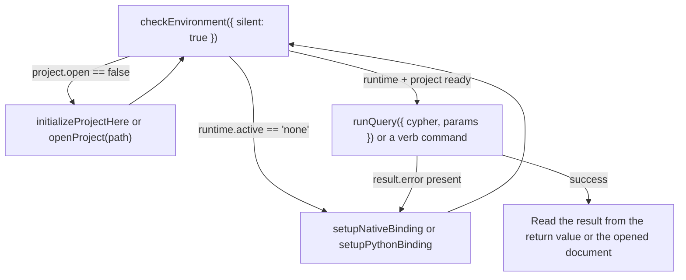

# Agent interop

Every command in [`commands.md`](commands.md) is a stable ID callable via
`vscode.commands.executeCommand("graphforge.<id>", ...)` — no Command Palette click required.
This makes GraphForge drivable end-to-end by an in-editor coding agent (a Cursor agent, GitHub
Copilot Agent Mode, or any other extension calling the VS Code command API), not just by a
human clicking through menus.

## The core loop

1. **Check Environment** — `executeCommand("graphforge.checkEnvironment", { silent: true })`.
   Inspect `runtime.active` (`"node" | "python" | "none"`), `nodeBinding.available`,
   `python.available`, and `project.open`; the returned `nextAction` string always names the
   exact next command to run.
2. **Setup / Init if needed** — if no runtime is usable, run `graphforge.setupNativeBinding`
   and/or `graphforge.setupPythonBinding`. If a runtime is ready but no project is open, run
   `graphforge.initializeProjectHere` (new project) or `graphforge.openProject(path)` (existing
   project — `path` is a plain string arg, no picker needed). Re-run step 1 to confirm.
3. **Run Query / Rank** — call `graphforge.runQuery({ cypher, params })` for Cypher, or one of
   the analyst verb commands (these still walk a QuickPick today).
4. **Read the result** — either the `executeCommand` return value, or the opened JSON document
   the command also writes for a human pairing with the agent. On failure, the returned
   object's `error` / `code` / `nextAction` fields tell you exactly what to do next — never a
   bare exception or a silent no-op.

## What's structured vs. interactive

| Command | Accepts args to skip prompts | Returns |
|---|---|---|
| `graphforge.checkEnvironment` | `{ silent?: boolean }` | `EnvironmentReport` always |
| `graphforge.openProject` | `pathArg?: string` | — |
| `graphforge.runQuery` / `runQueryWithParams` | `{ cypher?: string; params?: Record<string, unknown> }` | `QueryResult` (`{ columns, rows, rowCount, algorithm? }`) or a structured `{ error, code?, nextAction }` |
| `graphforge.rank` / `cluster` / `paths` / `analyze` / `similar` / `find` (and `…Advanced…`) | Not yet — still QuickPick-driven | Verb result object (`{ verb, by, label, columns, rows, rowCount, algorithm? }`), `{ error }`, or `{ cancelled: true }` |
| `graphforge.setupNativeBinding` / `setupPythonBinding` / `initializeProjectHere` / `loadOntology` / `showResultGraphAdvanced` | No — these are inherently human choices (which folder, which binding source) | — |

For a command not listed above, treat it as QuickPick/dialog-driven unless
`src/test/extension.test.ts` (source of truth, in the repository) says otherwise.

## Runtime awareness

`graphforge.runtime` (default `auto`) selects which engine backs a given call — see
[`install.md`](install.md) for the full Node-vs-Python policy. An agent that needs the advanced
Node-only surfaces (checkpoints, embedding spaces, indexing, invocation descriptors, composite
transactions, knowledge-ledger writes) should check `nodeBinding.available` from
`checkEnvironment` before calling them, since the Python bridge does not back those yet.
